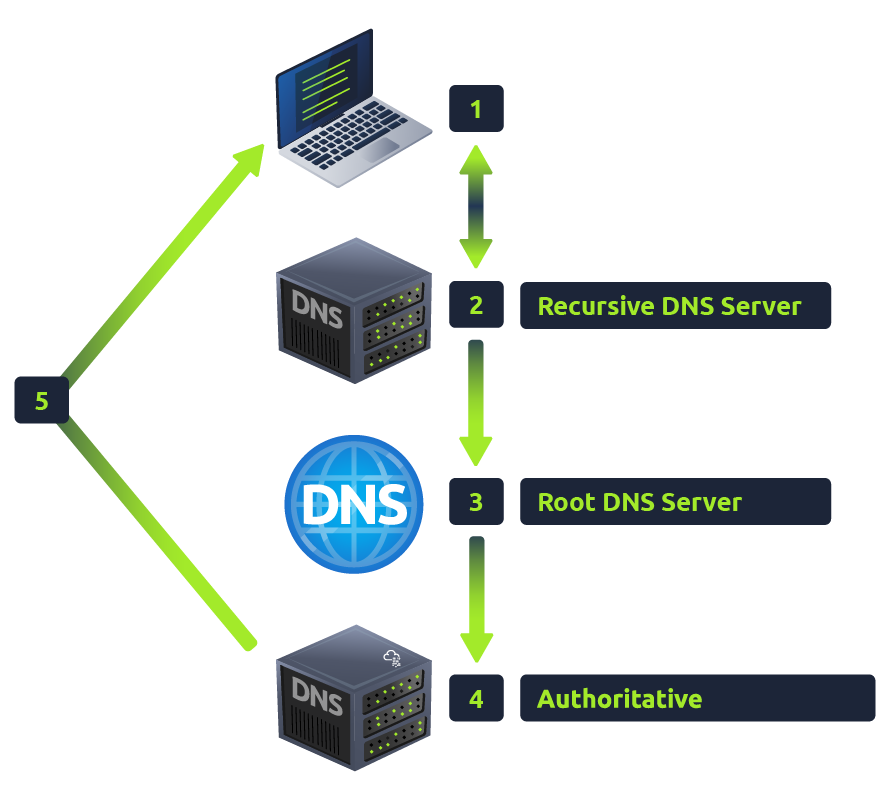

# **I, What is DNS?(Domain Name System)**

DNS (Hệ thống Tên miền) cung cấp một cách đơn giản để chúng ta giao tiếp với các thiết bị trên Internet mà không cần phải nhớ những dãy số phức tạp. Giống như mỗi ngôi nhà đều có một địa chỉ duy nhất để gửi thư trực tiếp, mỗi máy tính trên Internet đều có một địa chỉ duy nhất để giao tiếp với nó, được gọi là địa chỉ IP. Địa chỉ IP trông như sau: 104.26.10.229, gồm 4 bộ chữ số từ 0 đến 255, được phân cách bằng dấu chấm. Khi bạn muốn truy cập một trang web, việc nhớ dãy số phức tạp này không thực sự tiện lợi, và đó chính là lúc DNS có thể giúp ích. Vì vậy, thay vì nhớ 104.26.10.229, bạn có thể nhớ tryhackme.com .

# **II, Hệ thống phân cấp miền(Domain Hierarchy)**

###### **TLD (Tên miền cấp cao nhất)**

TLD là phần bên phải nhất của tên miền. Ví dụ, TLD của tryhackme.com là  .com . Có hai loại TLD: gTLD (Tên miền cấp cao nhất chung) và ccTLD (Tên miền cấp cao nhất theo mã quốc gia). Trước đây, gTLD nhằm mục đích cho người dùng biết mục đích của tên miền; ví dụ: .com dành cho mục đích thương mại, .org dành cho tổ chức, .edu dành cho giáo dục và .gov dành cho chính phủ. ccTLD cũng được sử dụng cho mục đích địa lý, ví dụ: .ca dành cho các trang web đặt tại Canada, .co.uk dành cho các trang web đặt tại Vương quốc Anh, v.v. Do nhu cầu như vậy, có rất nhiều gTLD mới xuất hiện, từ .online, .club, .website, .biz và nhiều hơn nữa.

###### **Tên miền cấp hai**

Lấy tryhackme.com làm ví dụ, phần .com là TLD, còn tryhackme là Tên miền Cấp hai. Khi đăng ký tên miền, tên miền cấp hai bị giới hạn ở 63 ký tự + TLD và chỉ có thể sử dụng các ký tự từ 0-9 và dấu gạch nối (không được bắt đầu hoặc kết thúc bằng dấu gạch nối hoặc có dấu gạch nối liền nhau).

###### **Tên miền phụ**

Tên miền phụ nằm ở phía bên trái của Tên miền cấp hai, sử dụng dấu chấm để phân tách; ví dụ: trong tên miền admin.tryhackme.com , phần quản trị là tên miền phụ. Tên miền phụ có cùng giới hạn tạo như Tên miền cấp hai, giới hạn ở 63 ký tự và chỉ được phép sử dụng các ký tự từ 0 đến 9 và dấu gạch nối (không được bắt đầu hoặc kết thúc bằng dấu gạch nối hoặc có dấu gạch nối liền nhau). Bạn có thể sử dụng nhiều tên miền phụ được phân tách bằng dấu chấm để tạo tên dài hơn, chẳng hạn như jupiter.servers.tryhackme.com . Tuy nhiên, độ dài phải được giữ ở mức 253 ký tự hoặc ít hơn. Không có giới hạn về số lượng tên miền phụ bạn có thể tạo cho tên miền của mình.

# **III, Các loại bản ghi(DNS Record Types)**

**Các loại bản ghi DNS**

Tuy nhiên, DNS không chỉ dành cho trang web, và có rất nhiều loại bản ghi DNS khác nhau. Chúng tôi sẽ điểm qua một số loại phổ biến nhất mà bạn có thể gặp phải.

**A Record**

Các bản ghi này phân giải thành địa chỉ IPv4, ví dụ 104.26.10.229

**AAAA Record**

Các bản ghi này phân giải thành địa chỉ IPv6, ví dụ 2606:4700:20::681a:be5

**CNAME Record**

Các bản ghi này sẽ phân giải thành một tên miền khác, ví dụ: cửa hàng trực tuyến của TryHackMe có tên miền phụ store.tryhackme.com , trả về bản ghi CNAME shops.shopify.com . Sau đó, một yêu cầu DNS khác sẽ được gửi đến shops.shopify.com để xác định địa chỉ IP.

**MX Record**

Các bản ghi này sẽ phân giải đến địa chỉ của các máy chủ xử lý email cho tên miền bạn đang truy vấn, ví dụ: phản hồi bản ghi MX cho tryhackme.com sẽ trông giống như  alt1.aspmx.l.google.com . Các bản ghi này cũng đi kèm với một cờ ưu tiên. Cờ này cho máy khách biết thứ tự thử các máy chủ, rất lý tưởng trong trường hợp máy chủ chính bị sập và email cần được gửi đến máy chủ dự phòng.

**TXT Record**

Bản ghi TXT là các trường văn bản tự do, nơi bất kỳ dữ liệu dạng văn bản nào cũng có thể được lưu trữ. Bản ghi TXT có nhiều công dụng, nhưng một số công dụng phổ biến có thể kể đến là liệt kê các máy chủ có thẩm quyền gửi email thay mặt cho tên miền (điều này có thể giúp chống lại thư rác và email giả mạo). Chúng cũng có thể được sử dụng để xác minh quyền sở hữu tên miền khi đăng ký dịch vụ của bên thứ ba.

# **IV, Đưa ra yêu cầu(Making A Request)**

**Điều gì xảy ra khi bạn thực hiện yêu cầu DNS**

1. Khi bạn yêu cầu tên miền, máy tính của bạn sẽ kiểm tra bộ nhớ đệm cục bộ để xem bạn đã tra cứu địa chỉ này gần đây chưa; nếu chưa, yêu cầu sẽ được gửi đến Máy chủ DNS đệ quy của bạn.
2. Máy chủ DNS Đệ quy thường được cung cấp bởi ISP của bạn, nhưng bạn cũng có thể tự chọn. Máy chủ này cũng có bộ nhớ đệm cục bộ chứa các tên miền đã tra cứu gần đây. Nếu kết quả được tìm thấy cục bộ, kết quả sẽ được gửi trở lại máy tính của bạn và yêu cầu của bạn sẽ kết thúc tại đây (điều này thường gặp ở các dịch vụ phổ biến và được yêu cầu nhiều như Google, Facebook, Twitter). Nếu yêu cầu không được tìm thấy cục bộ, hành trình tìm kiếm câu trả lời chính xác sẽ bắt đầu, bắt đầu từ các máy chủ DNS gốc của Internet .
3. Máy chủ gốc hoạt động như xương sống DNS của Internet; nhiệm vụ của chúng là chuyển hướng bạn đến Máy chủ Tên miền Cấp cao nhất (Top Level Domain Server) chính xác, tùy thuộc vào yêu cầu của bạn. Ví dụ: nếu bạn yêu cầu www.tryhackme.com , máy chủ gốc sẽ nhận dạng Tên miền Cấp cao nhất (Top Level Domain) là .com và chuyển hướng bạn đến máy chủ TLD chính xác xử lý địa chỉ .com.
4. Máy chủ TLD lưu trữ các bản ghi về vị trí tìm máy chủ có thẩm quyền để trả lời yêu cầu DNS . Máy chủ có thẩm quyền thường được gọi là máy chủ tên miền. Ví dụ: máy chủ tên miền cho tryhackme.com là kip.ns.cloudflare.com và uma.ns.cloudflare.com . Bạn thường sẽ tìm thấy nhiều máy chủ tên miền cho một tên miền để làm phương án dự phòng trong trường hợp một máy chủ bị sập. 
5. Máy chủ DNS có thẩm quyền là máy chủ chịu trách nhiệm lưu trữ các bản ghi DNS cho một tên miền cụ thể và nơi thực hiện bất kỳ cập nhật nào cho các bản ghi DNS tên miền của bạn. Tùy thuộc vào loại bản ghi, bản ghi DNS sau đó được gửi trở lại Máy chủ DNS Đệ quy , tại đó một bản sao cục bộ sẽ được lưu vào bộ nhớ đệm cho các yêu cầu trong tương lai và sau đó được chuyển tiếp trở lại máy khách ban đầu đã thực hiện yêu cầu. Tất cả các bản ghi DNS đều đi kèm với giá trị TTL (Thời gian tồn tại). Giá trị này là một số được biểu thị bằng giây mà phản hồi sẽ được lưu cục bộ cho đến khi bạn phải tra cứu lại. Việc lưu vào bộ nhớ đệm giúp bạn không phải tạo yêu cầu DNS mỗi khi giao tiếp với máy chủ.

