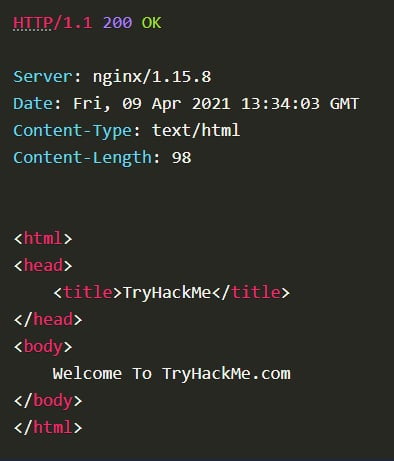

# **I, What is HTTP(S)?**

**HTTP là gì ? (Giao thức truyền siêu văn bản - HyperText Transfer Protocol)**

HTTP là giao thức được sử dụng mỗi khi bạn xem một trang web, được phát triển bởi Tim Berners-Lee và nhóm của ông từ năm 1989 đến năm 1991. HTTP là tập hợp các quy tắc được sử dụng để giao tiếp với máy chủ web nhằm truyền dữ liệu trang web, có thể là HTML, Hình ảnh, Video, v.v.

**HTTPS là gì? (Giao thức truyền siêu văn bản bảo mật - HyperText Transfer Protocol Secure)**

HTTPS là phiên bản bảo mật của HTTP . Dữ liệu HTTPS được mã hóa nên không chỉ ngăn người khác nhìn thấy dữ liệu bạn nhận và gửi mà còn đảm bảo rằng bạn đang giao tiếp với đúng máy chủ web chứ không phải thứ gì đó mạo danh máy chủ đó.

# **II, Yêu cầu và phản hồi(Requests And Responses)**

Khi chúng ta truy cập một trang web, trình duyệt của bạn sẽ cần gửi yêu cầu đến máy chủ web để lấy các tài nguyên như HTML, Hình ảnh và tải xuống phản hồi. Trước đó, bạn cần cho trình duyệt biết cụ thể cách thức và vị trí truy cập các tài nguyên này, và URL sẽ giúp ích trong trường hợp này.

**URL là gì? (Uniform Resource Locator)**

Nếu bạn đã từng sử dụng Internet, hẳn bạn đã từng sử dụng URL. URL chủ yếu là hướng dẫn về cách truy cập một tài nguyên trên Internet. Hình ảnh bên dưới cho thấy URL trông như thế nào với tất cả các tính năng của nó (nó không sử dụng tất cả các tính năng trong mọi yêu cầu).

**Scheme**: Hướng dẫn sử dụng giao thức nào để truy cập tài nguyên như HTTP , HTTPS, FTP (Giao thức truyền tệp).

**User**: Một số dịch vụ yêu cầu xác thực để đăng nhập, bạn có thể nhập tên người dùng và mật khẩu vào URL để đăng nhập.

**Host**: Tên miền hoặc địa chỉ IP của máy chủ mà bạn muốn truy cập.

**Port**: Cổng mà bạn sẽ kết nối tới, thường là 80 cho HTTP và 443 cho HTTPS, nhưng có thể lưu trữ trên bất kỳ cổng nào từ 1 - 65535.

**Path**: Tên tệp hoặc vị trí của tài nguyên mà bạn đang cố truy cập.

**Query Strings**: Các bit thông tin bổ sung có thể được gửi đến đường dẫn được yêu cầu. Ví dụ: /blog? id=1 sẽ cho đường dẫn blog biết rằng bạn muốn nhận bài viết blog có id là 1.

**Fragment**: Đây là tham chiếu đến một vị trí trên trang thực tế được yêu cầu. Điều này thường được sử dụng cho các trang có nội dung dài và có thể có một phần nhất định của trang được liên kết trực tiếp đến nó, để người dùng có thể xem được ngay khi họ truy cập trang.

**Making a Request**
Có thể gửi yêu cầu đến máy chủ web chỉ bằng một dòng **GET / HTTP /1.1**

Ví dụ yêu cầu:
**GET / HTTP/1.1**
**Host: tryhackme.com**
**User-Agent: Mozilla/5.0 Firefox/87.0**
**Referer: https://tryhackme.com/**

Để phân tích từng dòng của yêu cầu này:

**Dòng 1**: Yêu cầu này đang gửi phương thức GET (thông tin chi tiết hơn trong tác vụ Phương thức HTTP ), yêu cầu trang chủ bằng / và thông báo cho máy chủ web rằng chúng tôi đang sử dụng giao thức HTTP phiên bản 1.1.

**Dòng 2**: Chúng tôi nói với máy chủ web rằng chúng tôi muốn trang web tryhackme.com

**Dòng 3**: Chúng tôi thông báo cho máy chủ web rằng chúng tôi đang sử dụng Trình duyệt Firefox phiên bản 87

**Dòng 4**: Chúng tôi đang thông báo cho máy chủ web rằng trang web giới thiệu chúng tôi đến trang này là https://tryhackme.com

**Dòng 5**: Yêu cầu HTTP luôn kết thúc bằng một dòng trống để thông báo cho máy chủ web rằng yêu cầu đã hoàn tất.

Ví dụ phản hồi:

Để phân tích từng dòng của phản hồi:

**Dòng 1**: HTTP 1.1 là phiên bản giao thức HTTP mà máy chủ đang sử dụng và theo sau là Mã trạng thái HTTP trong trường hợp này là "200 OK" cho chúng ta biết yêu cầu đã hoàn tất thành công.

**Dòng 2**: Dòng này cho chúng ta biết phần mềm máy chủ web và số phiên bản.

**Dòng 3**: Ngày, giờ và múi giờ hiện tại của máy chủ web.

**Dòng 4**: Tiêu đề Content-Type cho máy khách biết loại thông tin nào sẽ được gửi, chẳng hạn như HTML, hình ảnh, video, pdf, XML .

**Dòng 5**: Content-Length cho máy khách biết độ dài của phản hồi, theo cách này chúng ta có thể xác nhận không có dữ liệu nào bị thiếu.

**Dòng 6**: Phản hồi HTTP chứa một dòng trống để xác nhận kết thúc phản hồi HTTP .

**Dòng 7-14**: Thông tin được yêu cầu, trong trường hợp này là trang chủ.

# **III, Phương pháp HTTP(HTTP Methods)**

Phương thức HTTP là cách để máy khách thể hiện hành động dự định khi thực hiện một yêu cầu HTTP . Có rất nhiều phương thức HTTP , nhưng chúng tôi sẽ đề cập đến những phương thức phổ biến nhất, mặc dù chủ yếu bạn sẽ xử lý phương thức GET và POST.

* **Yêu cầu GET** : Được sử dụng để lấy thông tin từ máy chủ web.

* **Yêu cầu POST** : Điều này được sử dụng để gửi dữ liệu đến máy chủ web và có khả năng tạo các bản ghi mới

* **Yêu cầu PUT** : Điều này được sử dụng để gửi dữ liệu đến máy chủ web để cập nhật thông tin

* **Yêu cầu DELETE** : Được sử dụng để xóa thông tin/bản ghi khỏi máy chủ web.

# **IV, Mã trạng thái HTTP(HTTP Status Codes)**

###### **Mã trạng thái HTTP :**

Trong bài tập trước, bạn đã học rằng khi máy chủ HTTP phản hồi, dòng đầu tiên luôn chứa mã trạng thái thông báo cho máy khách về kết quả yêu cầu của họ và cũng có thể là cách xử lý yêu cầu đó. Các mã trạng thái này có thể được chia thành 5 phạm vi khác nhau:

- **100-199** - Phản hồi thông tin	Những mã này được gửi để thông báo cho khách hàng rằng phần đầu tiên của yêu cầu đã được chấp nhận và họ nên tiếp tục gửi phần còn lại của yêu cầu. Những mã này hiện không còn phổ biến nữa.

- **200-299** - Thành công	Dãy mã trạng thái này được sử dụng để thông báo cho khách hàng rằng yêu cầu của họ đã thành công.

- **300-399** - Chuyển hướng	Chúng được sử dụng để chuyển hướng yêu cầu của khách hàng đến một tài nguyên khác. Có thể là một trang web khác hoặc một trang web hoàn toàn khác.

- **400-499** - Lỗi của khách hàng	Được sử dụng để thông báo cho khách hàng rằng có lỗi trong yêu cầu của họ.

- **500-599** - Lỗi máy chủ	Điều này dành riêng cho các lỗi xảy ra ở phía máy chủ và thường chỉ ra một vấn đề khá lớn với máy chủ khi xử lý yêu cầu.

###### **Mã trạng thái HTTP phổ biến :**

Có rất nhiều mã trạng thái HTTP khác nhau và chưa kể đến việc các ứng dụng thậm chí có thể tự xác định mã trạng thái của riêng mình, chúng tôi sẽ xem xét các phản hồi HTTP phổ biến nhất mà bạn có thể gặp phải:

- **200 - Được(200 - OK) :**	Yêu cầu đã được hoàn thành thành công.

- **201 - Đã tạo(201 - Created) :**	Một tài nguyên đã được tạo (ví dụ: người dùng mới hoặc bài đăng blog mới).

- **301 - Đã di chuyển vĩnh viễn(301 - Moved Permanently) :**	Thao tác này sẽ chuyển hướng trình duyệt của khách hàng đến một trang web mới hoặc thông báo cho các công cụ tìm kiếm rằng trang đã được di chuyển đến nơi khác và yêu cầu họ tìm kiếm ở đó.

- **302 - Đã tìm thấy(302 - Found) :**	Tương tự như chuyển hướng vĩnh viễn ở trên, nhưng như tên gọi, đây chỉ là thay đổi tạm thời và có thể thay đổi lại trong tương lai gần.

- **400 - Yêu cầu không hợp lệ(400 - Bad Request) :**	Điều này cho trình duyệt biết có điều gì đó sai hoặc thiếu sót trong yêu cầu của họ. Đôi khi, điều này có thể được sử dụng nếu tài nguyên máy chủ web đang được yêu cầu mong đợi một tham số nhất định mà máy khách không gửi.

- **401 - Không được phép(401 - Not Authorised) :**	Hiện tại, bạn không được phép xem tài nguyên này cho đến khi bạn cấp quyền bằng ứng dụng web, thông thường là bằng tên người dùng và mật khẩu.

- **403 - Cấm(403 - Forbidden) :**	Bạn không có quyền xem tài nguyên này cho dù bạn có đăng nhập hay không.

- **405 - Phương pháp không được phép(405 - Method Not Allowed) :**	Tài nguyên không cho phép yêu cầu phương thức này, ví dụ, bạn gửi yêu cầu GET đến tài nguyên /create-account khi nó đang mong đợi yêu cầu POST.

- **404 - Không tìm thấy trang(404 - Page Not Found) :**	Trang/tài nguyên bạn yêu cầu không tồn tại.

- **500 - Lỗi dịch vụ nội bộ(500 - Internal Service Error) :**	Máy chủ đã gặp phải một số lỗi liên quan đến yêu cầu của bạn mà không biết cách xử lý đúng cách.

- **503 - Dịch vụ không khả dụng(503 - Service Unavailable)**	: Máy chủ này không thể xử lý yêu cầu của bạn vì quá tải hoặc đang ngừng hoạt động để bảo trì.

# **V, Tiêu đề(Headers)**

Tiêu đề là các bit dữ liệu bổ sung mà bạn có thể gửi đến máy chủ web khi thực hiện yêu cầu.

Mặc dù không bắt buộc phải có tiêu đề khi thực hiện yêu cầu HTTP , nhưng bạn sẽ thấy khó có thể xem trang web một cách chính xác.

**Tiêu đề yêu cầu chung**

Đây là những tiêu đề được gửi từ máy khách (thường là trình duyệt của bạn) đến máy chủ.

* **Máy chủ**: Một số máy chủ web lưu trữ nhiều trang web, do đó bằng cách cung cấp tiêu đề máy chủ, bạn có thể cho máy chủ biết trang web nào bạn cần, nếu không, bạn sẽ chỉ nhận được trang web mặc định cho máy chủ.
* **User-Agent**: Đây là phần mềm trình duyệt và số phiên bản của bạn, cho máy chủ web biết rằng phần mềm trình duyệt của bạn giúp định dạng trang web phù hợp với trình duyệt của bạn và một số thành phần của HTML, JavaScript và CSS chỉ khả dụng trên một số trình duyệt nhất định.
* **Độ dài nội dung(Content-Length)**: Khi gửi dữ liệu đến máy chủ web, chẳng hạn như trong biểu mẫu, độ dài nội dung sẽ cho máy chủ web biết lượng dữ liệu cần thiết trong yêu cầu web. Bằng cách này, máy chủ có thể đảm bảo không bỏ sót bất kỳ dữ liệu nào.
* **Accept-Encoding**: Cho máy chủ web biết trình duyệt hỗ trợ loại phương pháp nén nào để dữ liệu có thể được nén nhỏ hơn khi truyền qua Internet.
* **Cookie**: Dữ liệu được gửi đến máy chủ để giúp ghi nhớ thông tin của bạn (xem tác vụ cookie để biết thêm thông tin).

**Tiêu đề phản hồi chung**

Đây là các tiêu đề được máy chủ trả về cho máy khách sau khi có yêu cầu.

* **Set-Cookie**: Thông tin cần lưu trữ được gửi lại cho máy chủ web sau mỗi yêu cầu (xem tác vụ cookie để biết thêm thông tin).
* **Cache-Control**: Thời gian lưu trữ nội dung phản hồi trong bộ nhớ đệm của trình duyệt trước khi trình duyệt yêu cầu lại.
* **Content-Type**: Phần này cho máy khách biết loại dữ liệu nào đang được trả về, tức là HTML, CSS, JavaScript, Hình ảnh, PDF, Video, v.v. Khi sử dụng tiêu đề content-type, trình duyệt sẽ biết cách xử lý dữ liệu.
* **Mã hóa nội dung - Content-Encoding**: Phương pháp nào được sử dụng để nén dữ liệu nhằm làm cho dữ liệu nhỏ hơn khi gửi qua Internet.

# **VI, Cookies**
Có lẽ bạn đã từng nghe về cookie, chúng chỉ là một phần dữ liệu nhỏ được lưu trữ trên máy tính của bạn. Cookie được lưu khi bạn nhận được tiêu đề "Set-Cookie" từ máy chủ web. Sau đó, mỗi yêu cầu tiếp theo bạn thực hiện, bạn sẽ gửi dữ liệu cookie trở lại máy chủ web. Vì HTTP không có trạng thái (không lưu trữ các yêu cầu trước đó của bạn), cookie có thể được sử dụng để nhắc máy chủ web về danh tính của bạn, một số cài đặt cá nhân cho trang web hoặc liệu bạn đã từng truy cập trang web trước đó hay chưa. Hãy cùng xem xét ví dụ về yêu cầu HTTP này :

Cookie có thể được sử dụng cho nhiều mục đích, nhưng phổ biến nhất là để xác thực trang web. Giá trị cookie thường không phải là một chuỗi ký tự rõ ràng, nơi bạn có thể thấy mật khẩu, mà là một mã thông báo (mã bí mật duy nhất mà con người không dễ dàng đoán được).
