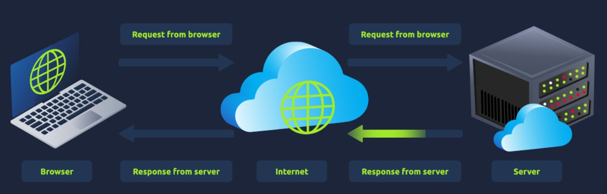
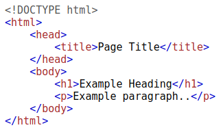
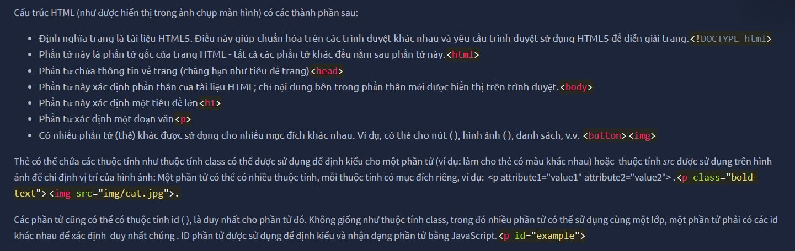
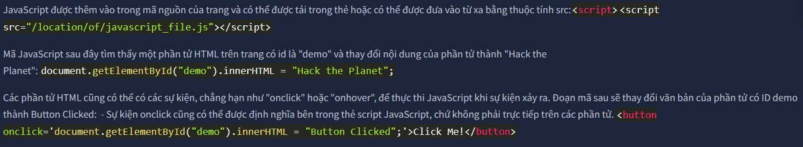
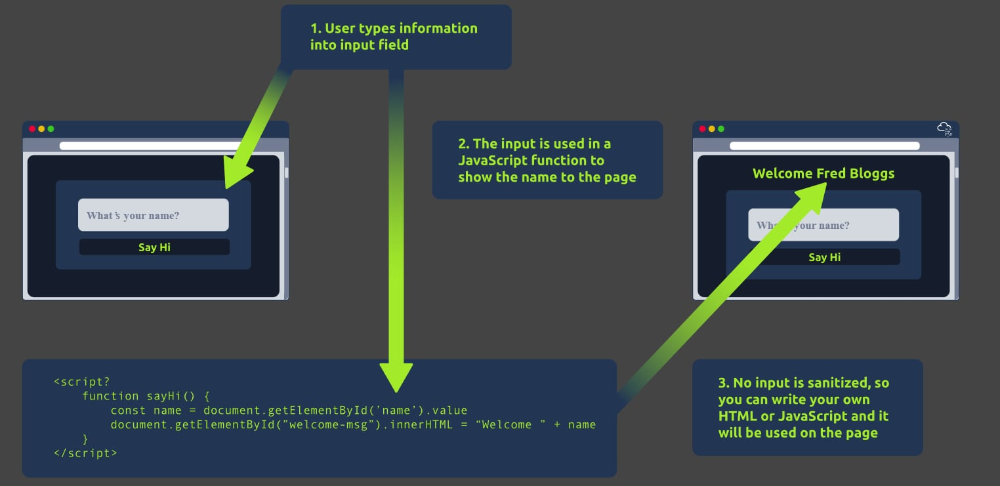

# **I, How websites work**
Khi bạn truy cập một trang web, trình duyệt của bạn ( như Safari hoặc Google Chrome ) sẽ gửi yêu cầu đến máy chủ web để xin thông tin về trang bạn đang truy cập. Máy chủ sẽ phản hồi dữ liệu mà trình duyệt sử dụng để hiển thị trang web cho bạn; máy chủ web chỉ là một máy tính chuyên dụng ở một nơi nào đó trên thế giới xử lý các yêu cầu của bạn.

Có hai thành phần chính tạo nên một trang web:

1. Giao diện người dùng - Front End (Phía máy khách - Client-Slide) - cách trình duyệt của bạn hiển thị trang web.
2. Back End (Server-Side - Phía máy chủ) - máy chủ xử lý yêu cầu của bạn và trả về phản hồi.

# **II, HTML**

Các trang web chủ yếu được tạo ra bằng cách sử dụng:
- HTML, để xây dựng trang web và xác định cấu trúc của chúng
- CSS, để làm cho các trang web trông đẹp hơn bằng cách thêm các tùy chọn kiểu dáng
- JavaScript, triển khai các tính năng phức tạp trên các trang bằng cách sử dụng tính tương tác

Ngôn ngữ đánh dấu siêu văn bản (HTML) là ngôn ngữ được sử dụng để viết các trang web. Các phần tử (còn được gọi là thẻ) là các khối xây dựng nên các trang HTML và cho trình duyệt biết cách hiển thị nội dung. Đoạn mã dưới đây minh họa một tài liệu HTML đơn giản, có cấu trúc giống nhau cho mọi trang web:

Cấu trúc HTML (như được hiển thị trong ảnh chụp màn hình) có các thành phần sau:

# **III, JavaScript**
JavaScript (JS) là một trong những ngôn ngữ lập trình phổ biến nhất thế giới và cho phép các trang web trở nên tương tác. HTML được sử dụng để tạo cấu trúc và nội dung trang web, trong khi JavaScript được sử dụng để kiểm soát chức năng của trang web - nếu không có JavaScript, một trang web sẽ không có các thành phần tương tác và sẽ luôn ở trạng thái tĩnh. JS có thể cập nhật trang web theo thời gian thực, cung cấp chức năng thay đổi kiểu nút khi một sự kiện cụ thể trên trang xảy ra (chẳng hạn như khi người dùng nhấp vào nút) hoặc hiển thị các hiệu ứng động.

# **IV, Tiết lộ dữ liệu nhạy cảm**
Việc lộ dữ liệu nhạy cảm xảy ra khi một trang web không bảo vệ (hoặc xóa) đúng cách thông tin văn bản rõ nhạy cảm đối với người dùng cuối; thường nằm trong mã nguồn giao diện của trang web.

Hiện nay, chúng ta đã biết rằng các trang web được xây dựng bằng nhiều thành phần HTML (thẻ), tất cả đều có thể được nhìn thấy chỉ bằng cách "xem mã nguồn trang". Nhà phát triển trang web có thể đã quên xóa thông tin đăng nhập, liên kết ẩn đến các phần riêng tư của trang web hoặc các dữ liệu nhạy cảm khác được hiển thị trong HTML hoặc JavaScript.

Thông tin nhạy cảm có thể bị lợi dụng để kẻ tấn công tiếp tục truy cập vào các phần khác nhau của ứng dụng web. Ví dụ: có thể có các bình luận HTML chứa thông tin đăng nhập tạm thời, và nếu bạn xem mã nguồn của trang và tìm thấy thông tin này, bạn có thể sử dụng thông tin đăng nhập này để đăng nhập vào các mục khác trên ứng dụng (hoặc tệ hơn, được sử dụng để truy cập các thành phần phụ trợ khác của trang web).

Bất cứ khi nào bạn đánh giá các vấn đề bảo mật của một ứng dụng web, một trong những điều đầu tiên bạn nên làm là xem lại mã nguồn của trang để xem liệu bạn có thể tìm thấy bất kỳ thông tin đăng nhập nào bị lộ hoặc liên kết ẩn hay không.

# **V, HTML Injection**
Tiêm mã HTML (HTML Injection) là một lỗ hổng xảy ra khi dữ liệu người dùng chưa được lọc hiển thị trên trang.  Nếu một trang web không thể lọc dữ liệu người dùng nhập (lọc bất kỳ văn bản "độc hại" nào mà người dùng nhập vào trang web) và dữ liệu đó được sử dụng trên trang, kẻ tấn công có thể chèn mã HTML vào trang web dễ bị tấn công.

Việc khử trùng dữ liệu đầu vào rất quan trọng trong việc bảo mật website, vì thông tin người dùng nhập vào website thường được sử dụng cho các chức năng front-end và back-end khác. Một lỗ hổng bạn sẽ khám phá trong bài lab khác là chèn dữ liệu vào cơ sở dữ liệu (database injection), trong đó bạn có thể thao túng truy vấn tra cứu cơ sở dữ liệu để đăng nhập với tư cách người dùng khác bằng cách kiểm soát dữ liệu đầu vào được sử dụng trực tiếp trong truy vấn - nhưng bây giờ, hãy tập trung vào chèn HTML (ở phía máy khách).

Khi người dùng kiểm soát cách hiển thị thông tin đầu vào của họ, họ có thể gửi mã HTML (hoặc JavaScript) và trình duyệt sẽ sử dụng mã đó trên trang, cho phép người dùng kiểm soát giao diện và chức năng của trang.

Hình ảnh trên cho thấy cách một biểu mẫu xuất văn bản ra trang. Bất cứ thông tin nào người dùng nhập vào trường "Tên bạn là gì" đều được truyền đến một hàm JavaScript và xuất ra trang. Điều này có nghĩa là nếu người dùng thêm mã HTML hoặc JavaScript của riêng họ vào trường, thông tin đó sẽ được sử dụng trong hàm sayHi và được thêm vào trang - điều này có nghĩa là bạn có thể thêm mã HTML của riêng mình (chẳng hạn như thẻ <h1) và nó sẽ xuất thông tin đầu vào của bạn dưới dạng HTML thuần túy.

Nguyên tắc chung là không bao giờ tin tưởng dữ liệu đầu vào của người dùng. Để ngăn chặn dữ liệu đầu vào độc hại, nhà phát triển trang web nên khử trùng mọi thứ người dùng nhập trước khi sử dụng trong hàm JavaScript; trong trường hợp này, nhà phát triển có thể xóa bất kỳ thẻ HTML nào.