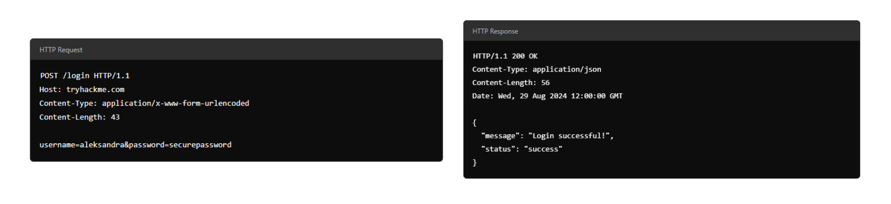
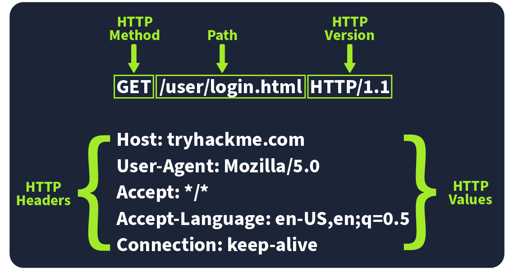
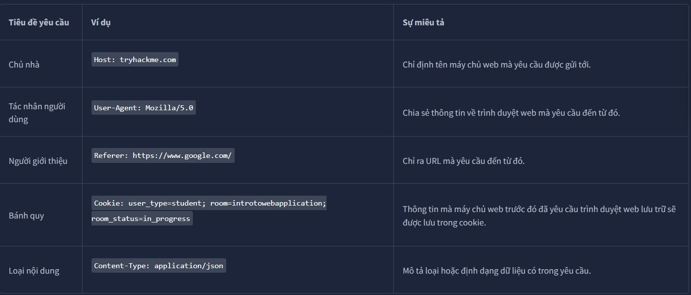

# **I, Tổng quan về ứng dụng web(Web Application Overview)**

Hãy xem xét một ví dụ tương tự về ứng dụng web như một hành tinh. Các phi hành gia du hành đến hành tinh để khám phá bề mặt của nó, tương tự như cách ai đó sử dụng trình duyệt web để khám phá hoặc duyệt một ứng dụng web. Mặc dù chúng ta chỉ nhìn thấy bề mặt của một hành tinh, nhưng có rất nhiều thứ đang diễn ra bên dưới bề mặt đó. Bạn có thể tưởng tượng toàn bộ hành tinh như một máy chủ web với rất nhiều thứ đang diễn ra bên dưới bề mặt của máy chủ web, nhưng tất cả những gì chúng ta thường thấy chỉ là bề mặt của các trang web hoặc ứng dụng. Bây giờ chúng ta sẽ khám phá các thành phần khác nhau tạo nên một ứng dụng web.

#### **Phần đầu(Front End)**

**Front End**  có thể được coi tương tự như bề mặt hành tinh, những phần mà phi hành gia có thể nhìn thấy và tương tác dựa trên các quy luật tự nhiên. Một ứng dụng web sẽ cho phép người dùng tương tác với nó và sử dụng một số công nghệ như HTML, CSS và JavaScript để thực hiện việc này.

**HTML (Ngôn ngữ Đánh dấu Siêu văn bản)** là một khía cạnh nền tảng của các ứng dụng web. Nó là một tập hợp các hướng dẫn hoặc mã lệnh hướng dẫn trình duyệt web hiển thị nội dung gì và cách hiển thị. Nó có thể được so sánh với các sinh vật đơn giản sống trên hành tinh; những sinh vật này có DNA, là những hướng dẫn về cách các sinh vật đơn giản được kết hợp với nhau.

**CSS  (Cascading Style Sheets)** trong các ứng dụng web mô tả giao diện chuẩn, chẳng hạn như màu sắc, kiểu văn bản và bố cục nhất định. Tiếp tục so sánh với DNA, chúng có thể được so sánh với các phần DNA mô tả màu sắc, hình dạng, kích thước và kết cấu của một sinh vật đơn giản.

**JS  (JavaScript)** là một phần của giao diện ứng dụng web, cho phép thực hiện các hoạt động phức tạp hơn trên trình duyệt web. Trong khi HTML có thể được coi là một tập hợp các hướng dẫn đơn giản về nội dung hiển thị, JavaScript là một tập hợp các hướng dẫn nâng cao hơn, cho phép lựa chọn và quyết định nội dung hiển thị. Trong phép so sánh với hành tinh, JavaScript có thể được coi là bộ não của một sinh vật tiên tiến, cho phép đưa ra quyết định dựa trên nội dung và cách thức tương tác của một vật với nó.

#### **Phần cuối(Back End)**

Phần cuối của một ứng dụng web là những thứ bạn không nhìn thấy trong trình duyệt web nhưng lại rất quan trọng để ứng dụng web hoạt động. Trên một hành tinh, đây là những thứ phi thị giác: các cấu trúc giúp tòa nhà đứng vững, không khí và trọng lực giúp bàn chân đứng vững trên mặt đất.

**Cơ sở dữ liệu** là nơi thông tin có thể được lưu trữ, chỉnh sửa và truy xuất. Một ứng dụng web có thể muốn lưu trữ và truy xuất thông tin về sở thích của người dùng về việc hiển thị hay không hiển thị; thông tin này sẽ được lưu trữ trong cơ sở dữ liệu. Một hành tinh có thể có những cư dân tiên tiến hơn, lưu trữ thông tin về vị trí trên bản đồ, ghi chú vào nhật ký hoặc cất sách vào thư viện và hồ sơ vào tủ hồ sơ.

Có rất nhiều thành phần cơ sở hạ tầng khác hỗ trợ Ứng dụng Web, chẳng hạn như máy chủ web, máy chủ ứng dụng, lưu trữ, nhiều thiết bị mạng và phần mềm khác hỗ trợ ứng dụng web. Trên một hành tinh, đó là những con đường hiện hữu, những chiếc xe chạy trên những con đường đó, và nhiên liệu cung cấp năng lượng cho xe.

WAF  ( Tường lửa Ứng dụng Web ) là một thành phần tùy chọn cho các ứng dụng web. Nó giúp lọc các yêu cầu nguy hiểm khỏi Máy chủ Web và cung cấp một yếu tố bảo vệ. Điều này có thể được coi tương tự như cách bầu khí quyển của một hành tinh bảo vệ cư dân khỏi tia UV có hại.

# Bộ định vị tài nguyên thống nhất(Uniform Resource Locator)

#### Bộ định vị tài nguyên thống nhất

Định vị Tài nguyên Thống nhất (URL) là một địa chỉ web cho phép bạn truy cập mọi loại nội dung trực tuyến—cho dù đó là trang web, video, ảnh hay phương tiện truyền thông khác. URL hướng dẫn trình duyệt của bạn đến đúng nơi trên Internet.

#### Giải phẫu của một URL

Hãy hình dung một URL được tạo thành từ nhiều phần, mỗi phần đóng một vai trò khác nhau trong việc giúp bạn tìm đúng tài nguyên. Việc hiểu cách các phần này kết hợp với nhau rất quan trọng khi duyệt web, phát triển ứng dụng web và thậm chí là khắc phục sự cố.

Sau đây là bảng phân tích các thành phần chính:

**Cơ chế(scheme)**

Giao thức này là giao thức được sử dụng để truy cập trang web. Phổ biến nhất là HTTP (Giao thức Truyền Siêu văn bản) và HTTPS (Giao thức Truyền Siêu văn bản Bảo mật). HTTPS an toàn hơn vì nó mã hóa kết nối, đó là lý do tại sao các trình duyệt và chuyên gia an ninh mạng khuyên dùng. Các trang web thường áp dụng HTTPS để tăng cường bảo mật.

**Người dùng(user)**

Một số URL có thể bao gồm thông tin đăng nhập của người dùng (thường là tên người dùng) cho các trang web yêu cầu xác thực. Điều này chủ yếu xảy ra ở các URL yêu cầu thông tin xác thực để truy cập một số tài nguyên nhất định. Tuy nhiên, hiện nay tình trạng này rất hiếm gặp vì việc đưa thông tin đăng nhập vào URL không thực sự an toàn—nó có thể làm lộ thông tin nhạy cảm, gây ra rủi ro bảo mật.

**Máy chủ/Tên miền(host/domain)**

Máy chủ hoặc tên miền là phần quan trọng nhất của URL vì nó cho bạn biết bạn đang truy cập trang web nào. Mỗi tên miền phải là duy nhất và được đăng ký thông qua các nhà đăng ký tên miền. Về mặt bảo mật, hãy tìm những tên miền trông gần giống tên miền thật nhưng có một số khác biệt nhỏ (đây được gọi là đánh cắp tên miền ). Những tên miền giả mạo này thường được sử dụng trong các cuộc tấn công lừa đảo để lừa người dùng cung cấp thông tin nhạy cảm.

**Cảng(port)**

Số cổng giúp định hướng trình duyệt của bạn đến đúng dịch vụ trên máy chủ web. Nó giống như việc cho máy chủ biết nên sử dụng cổng nào để giao tiếp. Số cổng nằm trong khoảng từ 1 đến 65.535, nhưng phổ biến nhất là 80 cho HTTP và 443 cho HTTPS.

**Con đường(path)**

Đường dẫn này trỏ đến tệp hoặc trang cụ thể trên máy chủ mà bạn đang cố gắng truy cập. Nó giống như một lộ trình chỉ đường cho trình duyệt biết cần đi đến đâu. Các trang web cần bảo mật những đường dẫn này để đảm bảo chỉ những người dùng được ủy quyền mới có thể truy cập các tài nguyên nhạy cảm.

**Chuỗi truy vấn(query string)**

Chuỗi truy vấn là phần URL bắt đầu bằng dấu chấm hỏi (?). Nó thường được sử dụng cho các mục đích như tìm kiếm hoặc nhập dữ liệu biểu mẫu. Vì người dùng có thể sửa đổi các chuỗi truy vấn này, điều quan trọng là phải xử lý chúng một cách an toàn để ngăn chặn các cuộc tấn công như chèn mã độc , có thể dẫn đến việc chèn mã độc.

**Mảnh vỡ(fragment)**

Đoạn mã bắt đầu bằng ký hiệu thăng (#) và giúp trỏ đến một phần cụ thể của trang web—giống như việc nhảy trực tiếp đến một tiêu đề hoặc bảng cụ thể. Người dùng cũng có thể sửa đổi đoạn mã này, vì vậy, giống như với chuỗi truy vấn, điều quan trọng là phải kiểm tra và dọn dẹp mọi dữ liệu ở đây để tránh các sự cố như tấn công chèn mã độc.

# **II, Tin nhắn HTTP(HTTP Messages)**

Thông điệp HTTP là các gói dữ liệu được trao đổi giữa người dùng (máy khách) và máy chủ web. Những thông điệp này rất quan trọng để hiểu cách thức hoạt động của các ứng dụng web vì chúng cho thấy cách thức các yêu cầu của người dùng và phản hồi của máy chủ được truyền đạt.

Hãy tưởng tượng một ví dụ về Yêu cầu HTTP và Phản hồi HTTP , trong đó bạn có thể thấy các thành phần chính như phương thức, URL, tiêu đề và mã trạng thái. Đây là những yếu tố tạo nên khả năng tương tác giữa máy khách và máy chủ.

Có hai loại tin nhắn HTTP :

* Yêu cầu HTTP(HTTP Request) : Được người dùng gửi để kích hoạt các hành động trên ứng dụng web.
* Phản hồi HTTP(HTTP Responses) : Được máy chủ gửi để phản hồi yêu cầu của người dùng.

Mỗi tin nhắn đều theo một định dạng cụ thể giúp cả người dùng và máy chủ giao tiếp dễ dàng.

**Dòng bắt đầu(Start Line)**

Dòng bắt đầu giống như phần giới thiệu của tin nhắn. Nó cho bạn biết loại tin nhắn nào đang được gửi đi—đó là yêu cầu từ người dùng hay phản hồi từ máy chủ. Dòng này cũng cung cấp các chi tiết quan trọng về cách xử lý tin nhắn.

**Tiêu đề(Headers)**

Tiêu đề được tạo thành từ các cặp khóa-giá trị cung cấp thông tin bổ sung về thông điệp HTTP . Chúng cung cấp hướng dẫn cho cả máy khách và máy chủ xử lý yêu cầu hoặc phản hồi. Các tiêu đề này bao gồm nhiều vấn đề, chẳng hạn như bảo mật, loại nội dung, v.v., đảm bảo mọi thứ diễn ra suôn sẻ trong quá trình giao tiếp.

**Dòng trống(Empty Line)**

Dòng trống là một dải phân cách nhỏ ngăn cách phần tiêu đề với phần nội dung. Điều này rất quan trọng vì nó cho thấy điểm kết thúc của phần tiêu đề và điểm bắt đầu của nội dung thực tế của thông điệp. Nếu không có dòng trống này, thông điệp có thể bị sai lệch, và máy khách hoặc máy chủ có thể hiểu sai, gây ra lỗi.

**Thân hình(Body)**

Phần thân là nơi lưu trữ dữ liệu thực tế. Trong một yêu cầu, phần thân có thể bao gồm dữ liệu người dùng muốn gửi đến máy chủ (như dữ liệu biểu mẫu). Trong một phản hồi, đây là nơi máy chủ đặt nội dung mà người dùng yêu cầu (như trang web hoặc dữ liệu API ).

Tại sao việc hiểu các thông điệp HTTP lại quan trọng

* Những thông điệp này là nền tảng cho cách các ứng dụng web giao tiếp. Nếu được cấu trúc đúng, mọi thứ sẽ hoạt động trơn tru.
* Biết cách chúng hoạt động sẽ giúp bạn chẩn đoán các sự cố trong giao tiếp web, nghĩa là cải thiện hiệu suất và độ tin cậy cho ứng dụng web của bạn.
* Điều này cũng rất quan trọng đối với bảo mật. Hiểu rõ các thông điệp HTTP giúp bạn triển khai các biện pháp bảo mật mạnh mẽ để bảo vệ dữ liệu trong quá trình truyền tải.

# **III, Yêu cầu HTTP: Dòng yêu cầu và phương thức**

Yêu cầu HTTP là những gì người dùng gửi đến máy chủ web để tương tác với ứng dụng web và thực hiện một thao tác nào đó. Vì những yêu cầu này thường là điểm tiếp xúc đầu tiên giữa người dùng và máy chủ web, nên việc hiểu rõ cách thức hoạt động của chúng là vô cùng quan trọng, đặc biệt nếu bạn đang tìm hiểu về an ninh mạng.

Hãy tưởng tượng một yêu cầu HTTP hiển thị các thành phần chính như phương thức (ví dụ: GET hoặc POST), đường dẫn (ví dụ: /login) và phiên bản (ví dụ: HTTP /1.1). Những thành phần này tạo nên nền tảng cơ bản về cách máy khách (người dùng) giao tiếp với máy chủ.

#### Dòng yêu cầu(Request Line)

Dòng yêu cầu (hay dòng bắt đầu) là phần đầu tiên của một yêu cầu HTTP và cho máy chủ biết loại yêu cầu nào đang được xử lý. Nó bao gồm ba phần chính: phương thức HTTP , đường dẫn URL và phiên bản HTTP .

Ví dụ: METHOD /path HTTP/version

#### Phương pháp HTTP(HTTP Methods)

Phương thức HTTP cho máy chủ biết hành động nào người dùng muốn thực hiện trên tài nguyên được xác định bởi đường dẫn URL. Dưới đây là một số phương thức phổ biến nhất và các vấn đề bảo mật có thể xảy ra của chúng:

**GET**

Dùng để lấy dữ liệu từ máy chủ mà không thực hiện bất kỳ thay đổi nào. Lưu ý! Đảm bảo bạn chỉ hiển thị dữ liệu mà người dùng được phép xem. Tránh đưa thông tin nhạy cảm như mã thông báo hoặc mật khẩu vào yêu cầu GET vì chúng có thể hiển thị dưới dạng văn bản thuần túy.

**POST**

Gửi dữ liệu đến máy chủ, thường là để tạo hoặc cập nhật dữ liệu. Lưu ý! Luôn xác thực và làm sạch dữ liệu đầu vào để tránh các cuộc tấn công như SQL injection hoặc XSS .

**PUT**

Thay thế hoặc cập nhật nội dung nào đó trên máy chủ. Lưu ý! Hãy đảm bảo người dùng được phép thực hiện thay đổi trước khi chấp nhận yêu cầu.

**DELETE**

Xóa một mục nào đó khỏi máy chủ. Lưu ý! Giống như PUT, hãy đảm bảo chỉ những người dùng được ủy quyền mới có thể xóa tài nguyên.

Bên cạnh những phương pháp phổ biến này, còn có một số phương pháp khác được sử dụng trong những trường hợp cụ thể:

**PATCH**

Cập nhật một phần tài nguyên. Lệnh này hữu ích khi thực hiện những thay đổi nhỏ mà không cần thay thế toàn bộ, nhưng luôn xác thực dữ liệu để tránh sự không nhất quán.

**HEAD**

hoạt động giống GET nhưng chỉ lấy tiêu đề, không lấy toàn bộ nội dung. Nó rất tiện lợi để kiểm tra siêu dữ liệu mà không cần tải xuống toàn bộ phản hồi.

**TÙY CHỌN(Opitions)**

Cho bạn biết những phương pháp nào có sẵn cho một tài nguyên cụ thể, giúp khách hàng hiểu những gì họ có thể làm với máy chủ.

**TRACE**

Tương tự như OPTIONS, nó hiển thị những phương thức nào được phép, thường dùng để gỡ lỗi. Nhiều máy chủ vô hiệu hóa nó vì lý do bảo mật.

**CONNECT**

Được sử dụng để tạo kết nối an toàn, chẳng hạn như HTTPS. Giao thức này không phổ biến nhưng rất quan trọng đối với giao tiếp được mã hóa.

Mỗi phương pháp này đều có bộ quy tắc bảo mật riêng. Ví dụ: yêu cầu PATCH cần được xác thực để tránh sự không nhất quán, và OPTIONS và TRACE nên được tắt nếu không cần thiết để tránh các rủi ro bảo mật có thể xảy ra.

#### Đường dẫn URL(URL Path)

Đường dẫn URL cho máy chủ biết nơi tìm tài nguyên mà người dùng đang yêu cầu. Ví dụ: trong URL https://tryhackme.com/api/users/123, đường dẫn /api/users/123 xác định một người dùng cụ thể.

Kẻ tấn công thường cố gắng thao túng đường dẫn URL để khai thác lỗ hổng, vì vậy điều quan trọng là phải:

* Xác thực đường dẫn URL để ngăn chặn truy cập trái phép
* Vệ sinh đường dẫn để tránh các cuộc tấn công tiêm nhiễm
* Bảo vệ dữ liệu nhạy cảm bằng cách tiến hành đánh giá quyền riêng tư và rủi ro

Thực hiện các biện pháp này sẽ giúp bảo vệ ứng dụng web của bạn khỏi các cuộc tấn công phổ biến.

#### Phiên bản HTTP(HTTP Version)

Phiên bản HTTP hiển thị phiên bản giao thức   được sử dụng để giao tiếp giữa máy khách và máy chủ. Dưới đây là tóm tắt nhanh về những giao thức phổ biến nhất:

* **HTTP /0.9 (1991)** : Phiên bản đầu tiên chỉ hỗ trợ các yêu cầu GET.

* **HTTP /1.0 (1996)** : Thêm tiêu đề và hỗ trợ tốt hơn cho các loại nội dung khác nhau, cải thiện bộ nhớ đệm.

* **HTTP /1.1 (1997)** : mang lại kết nối liên tục, mã hóa truyền dữ liệu theo khối và bộ nhớ đệm tốt hơn. Nó vẫn được sử dụng rộng rãi cho đến ngày nay.

* **HTTP /2 (2015)** : Giới thiệu các tính năng như ghép kênh, nén tiêu đề và ưu tiên để có hiệu suất nhanh hơn.

* **HTTP /3 (2022)** : Được xây dựng trên HTTP /2, nhưng sử dụng giao thức mới (QUIC) để kết nối nhanh hơn và an toàn hơn.

Mặc dù HTTP /2 và HTTP /3 mang lại tốc độ và bảo mật tốt hơn, nhiều hệ thống vẫn sử dụng HTTP /1.1 vì nó được hỗ trợ tốt và tương thích với hầu hết các thiết lập hiện có. Tuy nhiên, việc nâng cấp lên HTTP /2 hoặc HTTP /3 có thể mang lại những cải tiến đáng kể về hiệu suất và bảo mật khi ngày càng nhiều hệ thống áp dụng chúng.

# **IV, Yêu cầu HTTP: Tiêu đề và Nội dung(HTTP Request : Headers and Body)**

#### Tiêu đề yêu cầu(Request Headers)

Tiêu đề yêu cầu cho phép truyền tải thêm thông tin về yêu cầu đến máy chủ web. Một số tiêu đề phổ biến như sau:

###### Tiêu đề yêu cầu chung

#### Yêu cầu cơ thể(Request Body)

Trong các yêu cầu HTTP như POST và PUT, dữ liệu được gửi đến máy chủ web thay vì được yêu cầu từ máy chủ web, dữ liệu được đặt bên trong Thân Yêu cầu HTTP . Định dạng dữ liệu có thể có nhiều dạng, nhưng một số dạng phổ biến là  URL Encoded, Form Data, JSON, hoặc XML.

* URL được mã hóa (application/x-www-form-urlencoded)

Định dạng mà dữ liệu được cấu trúc theo cặp khóa và giá trị, trong đó ( key=value). Nhiều cặp được phân tách bằng \&ký hiệu (), chẳng hạn như  key1=value1\&key2=value2. Các ký tự đặc biệt được mã hóa theo phần trăm.

Ví dụ : 
**POST /profile HTTP/1.1
Host: tryhackme.com
User-Agent: Mozilla/5.0
Content-Type: application/x-www-form-urlencoded
Content-Length: 33
name=Aleksandra\&age=27\&country=US**

* Dữ liệu Biểu mẫu (multipart/form-data)

Cho phép gửi nhiều khối dữ liệu, mỗi khối được phân tách bằng một chuỗi ranh giới. Chuỗi ranh giới này là tiêu đề được xác định của chính yêu cầu. Kiểu định dạng này có thể được sử dụng để gửi dữ liệu nhị phân, chẳng hạn như khi tải tệp hoặc hình ảnh lên máy chủ web.

Ví dụ : 
**POST /upload HTTP/1.1
Host: tryhackme.com
User-Agent: Mozilla/5.0
Content-Type: multipart/form-data; boundary=----WebKitFormBoundary7MA4YWxkTrZu0gW**

**----WebKitFormBoundary7MA4YWxkTrZu0gW
Content-Disposition: form-data; name="username"**

**aleksandra
----WebKitFormBoundary7MA4YWxkTrZu0gW
Content-Disposition: form-data; name="profile\_pic"; filename="aleksandra.jpg"
Content-Type: image/jpeg**

**\[Binary Data Here representing the image]
----WebKitFormBoundary7MA4YWxkTrZu0gW--**

* JSON (application/ json )

Ở định dạng này, dữ liệu có thể được gửi bằng cấu trúc JSON (JavaScript Object Notation). Dữ liệu được định dạng theo cặp name : value. Nhiều cặp được phân tách bằng dấu phẩy, tất cả đều nằm trong dấu ngoặc nhọn { }.

Ví dụ :
**POST /api/user HTTP/1.1
Host: tryhackme.com
User-Agent: Mozilla/5.0
Content-Type: application/json
Content-Length: 62**

**{
    "name": "Aleksandra",
    "age": 27,
    "country": "US"
}**

* XML (application/ xml )

Trong  định dạng XML  , dữ liệu được cấu trúc bên trong các nhãn gọi là thẻ, có phần mở đầu và phần đóng. Các nhãn này có thể được lồng vào nhau. Bạn có thể thấy trong ví dụ bên dưới phần mở đầu và đóng của các thẻ để gửi thông tin chi tiết về người dùng tên là Aleksandra.

Ví dụ : 
POST /api/user HTTP/1.1
Host: tryhackme.com
User-Agent: Mozilla/5.0
Content-Type: application/xml
Content-Length: 124

**<user>
    <name>Aleksandra</name>

    <age>27</age>

    <country>US</country>

</user>**

# **V, Phản hồi HTTP: Dòng trạng thái và Mã trạng thái(HTTP Response: Status Line and Status Codes)**

Khi bạn tương tác với một ứng dụng web, máy chủ sẽ gửi lại phản hồi HTTP để cho bạn biết yêu cầu của bạn đã thành công hay có sự cố. Các phản hồi này bao gồm mã trạng thái và một lời giải thích ngắn gọn (gọi là Cụm từ Lý do ) cung cấp thông tin chi tiết về cách máy chủ xử lý yêu cầu của bạn.

#### Dòng trạng thái(Status Line)

Dòng đầu tiên trong mỗi phản hồi HTTP được gọi là Dòng Trạng thái . Nó cung cấp cho bạn ba thông tin chính:

* Phiên bản HTTP : Thông tin này cho bạn biết phiên bản HTTP nào đang được sử dụng.
* Mã trạng thái : Số gồm ba chữ số hiển thị kết quả yêu cầu của bạn.
* Cụm từ lý do : Một thông báo ngắn giải thích mã trạng thái theo cách dễ hiểu đối với con người.

#### Mã trạng thái và cụm từ lý do(Status Codes and Reason Phrases)

Mã Trạng thái là số cho biết yêu cầu thành công hay thất bại, trong khi Cụm từ Lý do giải thích điều gì đã xảy ra. Các mã này được chia thành năm loại chính:

**Phản hồi thông tin (100-199)**

Các mã này có nghĩa là máy chủ đã nhận được một phần yêu cầu và đang chờ phần còn lại . Đây là tín hiệu "tiếp tục".

**Phản hồi thành công (200-299)**

Các mã này có nghĩa là mọi thứ hoạt động như mong đợi. Máy chủ đã xử lý yêu cầu và gửi lại dữ liệu được yêu cầu.

**Tin nhắn chuyển hướng (300-399)**

Các mã này cho bạn biết rằng tài nguyên bạn yêu cầu đã được chuyển đến một vị trí khác, thường cung cấp URL mới.

**Phản hồi lỗi từ máy khách (400-499)**

Các mã này cho biết yêu cầu có vấn đề. Có thể URL bị sai hoặc bạn thiếu một số thông tin bắt buộc, chẳng hạn như xác thực.

**Phản hồi lỗi máy chủ (500-599)**

Các mã này có nghĩa là máy chủ đã gặp lỗi khi cố gắng thực hiện yêu cầu. Đây thường là sự cố phía máy chủ chứ không phải lỗi của máy khách.

#### Mã trạng thái chung(Common Status Codes)

Sau đây là một số mã trạng thái thường thấy nhất:

**100 (Tiếp tục)**

Máy chủ đã nhận được phần đầu tiên của yêu cầu và sẵn sàng cho phần còn lại .

**200 (OK)**

Yêu cầu đã thành công và máy chủ đang gửi lại tài nguyên được yêu cầu.

**301 (Đã di chuyển vĩnh viễn)**

Tài nguyên bạn đang yêu cầu đã được di chuyển vĩnh viễn đến một URL mới. Hãy sử dụng URL mới từ bây giờ.

**404 (Không tìm thấy)**

Máy chủ không tìm thấy tài nguyên tại URL đã cho. Vui lòng kiểm tra lại xem bạn đã nhập đúng địa chỉ chưa.

**500 (Lỗi máy chủ nội bộ)**

Đã xảy ra lỗi ở phía máy chủ và không thể xử lý yêu cầu của bạn.

# **VI, Phản hồi HTTP: Tiêu đề và Nội dung**

#### Tiêu đề phản hồi(Response Headers)

Khi máy chủ web phản hồi một yêu cầu HTTP , nó sẽ bao gồm các tiêu đề phản hồi HTTP , về cơ bản là các cặp khóa-giá trị. Các tiêu đề này cung cấp thông tin quan trọng về phản hồi và cho máy khách (thường là trình duyệt) biết cách xử lý.

Hãy hình dung ví dụ về phản hồi HTTP với các tiêu đề được tô sáng. Các tiêu đề chính như **Content-Type**, **Content-Length**, và **Date** cung cấp cho chúng ta thông tin chi tiết quan trọng về phản hồi mà máy chủ gửi lại.

#### Tiêu đề phản hồi bắt buộc

Một số tiêu đề phản hồi rất quan trọng để đảm bảo phản hồi HTTP hoạt động bình thường. Chúng cung cấp thông tin cần thiết mà cả máy khách và máy chủ cần để xử lý mọi thứ một cách chính xác. Dưới đây là một vài tiêu đề quan trọng:

* **Ngày :**

Ví dụ: **Date: Fri, 23 Aug 2024 10:43:21 GMT**

Tiêu đề này hiển thị ngày và giờ chính xác khi phản hồi được máy chủ tạo ra.

* **Content-Type :**

Ví dụ: **Content-Type: text/html; charset=utf-8**

Thuộc tính này cho biết loại nội dung mà máy khách đang nhận được, chẳng hạn như HTML, JSON hay nội dung nào khác. Thuộc tính này cũng bao gồm bộ ký tự (như UTF-8) để giúp trình duyệt hiển thị nội dung chính xác.

* **Máy chủ :**

Ví dụ: **Server: nginx**

Tiêu đề này hiển thị loại phần mềm máy chủ nào đang xử lý yêu cầu. Tiêu đề này hữu ích cho việc gỡ lỗi, nhưng cũng có thể tiết lộ thông tin máy chủ có thể hữu ích cho kẻ tấn công, vì vậy nhiều người thường xóa hoặc che giấu tiêu đề này.

#### Các tiêu đề phản hồi phổ biến khác

Bên cạnh những tiêu đề thiết yếu, còn có những tiêu đề phổ biến khác cung cấp hướng dẫn bổ sung cho máy khách hoặc trình duyệt và giúp kiểm soát cách xử lý phản hồi.

* **Set-Cookie :**

Ví dụ: **Set-Cookie: sessionId=38af1337es7a8**

Phương thức này gửi cookie từ máy chủ đến máy khách, sau đó máy khách sẽ lưu trữ cookie và gửi lại cho các yêu cầu trong tương lai. Để đảm bảo an toàn, hãy đảm bảo cookie được thiết lập với HttpOnlycờ (để JavaScript không thể truy cập) và Securecờ (để cookie chỉ được gửi qua HTTPS).

* **Cache-Control :**

Ví dụ: **Cache-Control: max-age=600**

Tiêu đề này cho máy khách biết thời gian có thể lưu trữ phản hồi trong bộ nhớ đệm trước khi kiểm tra lại với máy chủ. Nó cũng có thể ngăn chặn thông tin nhạy cảm được lưu trữ trong bộ nhớ đệm nếu cần (sử dụng no-cache).

* **Vị trí :(Location)**

Ví dụ: **Location: /index.html**

Trường này được sử dụng trong các phản hồi chuyển hướng (3xx). Nó cho máy khách biết phải đi đâu tiếp theo nếu tài nguyên đã được di chuyển. Nếu người dùng có thể sửa đổi tiêu đề này trong khi yêu cầu, hãy cẩn thận xác thực và khử trùng nó—nếu không, bạn có thể gặp phải các lỗ hổng chuyển hướng mở, nơi kẻ tấn công có thể chuyển hướng người dùng đến các trang web độc hại.

#### Cơ quan phản hồi

Nội dung phản hồi HTTP là nơi chứa dữ liệu thực tế—những thứ như HTML, JSON , hình ảnh, v.v., mà máy chủ gửi lại cho máy khách. Để ngăn chặn các cuộc tấn công chèn mã độc như Cross-Site Scripting ( XSS ), hãy luôn khử trùng và loại bỏ mọi dữ liệu (đặc biệt là nội dung do người dùng tạo) trước khi đưa vào phản hồi.

# **VIII, Tiêu đề bảo mật(Security Headers)**

#### Tiêu đề bảo mật

Tiêu đề bảo mật HTTP giúp cải thiện bảo mật tổng thể của ứng dụng web bằng cách cung cấp các biện pháp giảm thiểu các cuộc tấn công như Cross-Site Scripting ( XSS ), clickjacking, v.v. Bây giờ, chúng ta sẽ tìm hiểu sâu hơn về các tiêu đề bảo mật sau:

* Chính sách bảo mật nội dung ( CSP )
* Bảo mật vận chuyển nghiêm ngặt (HSTS)
* Tùy chọn loại nội dung X
* Chính sách giới thiệu

Bạn có thể sử dụng trang web như **https://securityheaders.io/** để phân tích các tiêu đề bảo mật của bất kỳ trang web nào. Sau khi thảo luận về bài tập này, hy vọng bạn sẽ hiểu rõ hơn về nội dung mà nó báo cáo.

#### Chính sách bảo mật nội dung ( CSP :  Cloud Service Provider)

Tiêu đề CSP là một lớp bảo mật bổ sung có thể giúp giảm thiểu các cuộc tấn công phổ biến như Cross-Site Scripting ( XSS ). Mã độc hại có thể được lưu trữ trên một trang web hoặc tên miền riêng biệt và được đưa vào trang web dễ bị tấn công. CSP cung cấp cho quản trị viên cách xác định tên miền hoặc nguồn nào được coi là an toàn và cung cấp một lớp giảm thiểu các cuộc tấn công như vậy.

Ngay trong tiêu đề, bạn có thể thấy các thuộc tính như **default-src** hoặc **script-src** defined và nhiều thuộc tính khác. Mỗi thuộc tính này cung cấp cho quản trị viên tùy chọn xác định ở nhiều mức độ chi tiết khác nhau những tên miền nào được phép cho loại nội dung nào. Việc sử dụng self là một từ khóa đặc biệt phản ánh cùng một tên miền mà trang web được lưu trữ.

Nhìn vào một ví dụ về tiêu đề CSP :

**Content-Security-Policy: default-src 'self'; script-src 'self' https://cdn.tryhackme.com; style-src 'self'**

Chúng ta thấy việc sử dụng:

* **default-src** : chỉ định chính sách mặc định của self, nghĩa là chỉ trang web hiện tại.

* **script-src** : chỉ định chính sách về nơi các tập lệnh có thể được tải từ đó, chính sách này cũng giống như các tập lệnh được lưu trữ trênhttps://cdn.tryhackme.com

* **style-src** : chỉ định chính sách về nơi có thể tải các bảng định kiểu CSS từ trang web hiện tại (self)

#### Bảo mật vận chuyển nghiêm ngặt (HSTS)

Tiêu đề HSTS đảm bảo rằng trình duyệt web sẽ luôn kết nối qua HTTPS. Hãy xem một ví dụ về HSTS:

**Strict-Transport-Security: max-age=63072000; includeSubDomains; preload**

Sau đây là phân tích chi tiết về tiêu đề HSTS theo chỉ thị:

* **max-age** : Đây là thời gian hết hạn tính bằng giây cho cài đặt này

* **includeSubDomains** : Thiết lập tùy chọn hướng dẫn trình duyệt áp dụng thiết lập này cho tất cả các miền phụ.

* **Tải trước** : Cài đặt tùy chọn này cho phép đưa trang web vào danh sách tải trước. Trình duyệt có thể sử dụng danh sách tải trước để áp dụng HSTS ngay cả trước khi truy cập trang web lần đầu.

#### Tùy chọn loại nội dung X

Tiêu đề X-Content-Type-Options có thể được sử dụng để hướng dẫn trình duyệt không đoán thời gian MIME của một tài nguyên mà chỉ sử dụng tiêu đề Content-Type. Sau đây là một ví dụ:

**X-Content-Type-Options: nosniff**

Sau đây là phân tích chi tiết về tiêu đề X-Content-Type-Options theo chỉ thị:

* **nosniff** : Chỉ thị này hướng dẫn trình duyệt không đánh hơi hoặc đoán loại MIME .

#### Chính sách giới thiệu

Tiêu đề này kiểm soát lượng thông tin được gửi đến máy chủ web đích khi người dùng được chuyển hướng từ máy chủ web nguồn, chẳng hạn như khi họ nhấp vào siêu liên kết. Tiêu đề này cho phép quản trị viên web kiểm soát thông tin được chia sẻ. Dưới đây là một số ví dụ về Chính sách Giới thiệu:

* **Referrer-Policy: no-referrer**
* **Referrer-Policy: same-origin**
* **Referrer-Policy: strict-origin**
* **Referrer-Policy: strict-origin-when-cross-origin**

Sau đây là phân tích chi tiết về tiêu đề Referrer-Policy theo chỉ thị:

* **không có người giới thiệu(no-referrer)** : Điều này hoàn toàn vô hiệu hóa bất kỳ thông tin nào được gửi về người giới thiệu

* **same-origin** : Chính sách này sẽ chỉ gửi thông tin người giới thiệu khi đích đến thuộc cùng một nguồn gốc. Điều này hữu ích khi bạn muốn thông tin người giới thiệu được truyền đi khi các siêu liên kết nằm trong cùng một trang web nhưng không nằm ngoài các trang web bên ngoài.

* **strict-origin** : Chính sách này chỉ gửi người giới thiệu làm nguồn gốc khi giao thức không thay đổi. Vì vậy, người giới thiệu sẽ được gửi khi một kết nối HTTPS chuyển sang một kết nối HTTPS khác.

* **strict-origin-when-cross-origin** : Tương tự như strict-origin ngoại trừ các yêu cầu cùng nguồn gốc, trong đó nó gửi đường dẫn URL đầy đủ trong tiêu đề nguồn gốc.