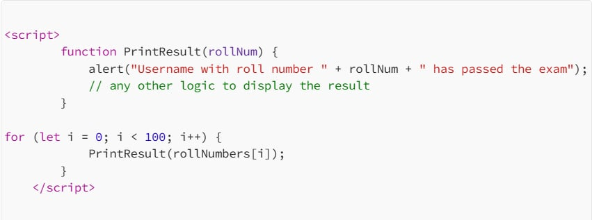

# **Các khái niệm cơ bản**
JavaScript (JS) là công nghệ cốt lõi của phát triển web, chạy trên phía máy khách để tăng tính tương tác, xử lý dữ liệu đầu vào của người dùng và thao tác DOM (Mô hình Đối tượng Documnet). JS rất linh hoạt và có thể được sử dụng như một ngôn ngữ hướng thủ tục hoặc hướng đối tượng. Một số khái niệm thiết yếu bao gồm:
*  **Biến**: Lưu trữ giá trị dữ liệu và có thể được khai báo bằng var, let, hoặc const.
* **Kiểu dữ liệu** : Bao gồm chuỗi, số, boolean, đối tượng và mảng. JavaScript được định kiểu động, nghĩa là kiểu được xác định khi chạy.
* **Chức năng** : Các khối mã được xác định để thực hiện các nhiệm vụ cụ thể và có thể được sử dụng lại với các đầu vào khác nhau.

#### Chức năng(Functions)

Hàm đại diện cho một khối mã được thiết kế để thực hiện một tác vụ cụ thể. Bên trong hàm, bạn nhóm các mã cần thực hiện một tác vụ tương tự. Ví dụ: bạn đang phát triển một ứng dụng web cần in kết quả của học sinh lên trang web. Trường hợp lý tưởng là tạo một hàm PrintResult(rollNum) chấp nhận số báo danh của người dùng làm đối số.

#### Vòng lặp(Loops)

Vòng lặp cho phép bạn chạy một khối mã nhiều lần miễn là điều kiện còn tồn tại true. Các vòng lặp phổ biến trong JS là for, while, và do...while, được sử dụng để lặp lại các tác vụ, chẳng hạn như duyệt qua danh sách các mục. Ví dụ: nếu chúng ta muốn in kết quả của 100 học sinh, chúng ta có thể gọi hàm PrintResult(rollNum) 100 lần bằng cách viết 100 lần, hoặc chúng ta có thể tạo một vòng lặp sẽ được lặp lại từ 1 đến 100 và sẽ gọi hàm PrintResult(rollNum) như minh họa bên dưới.

#### Chu kỳ yêu cầu-phản hồi(Request-Response Cycle)

Trong phát triển web, chu trình yêu cầu-phản hồi là khi trình duyệt của người dùng (máy khách) gửi yêu cầu đến máy chủ web và máy chủ phản hồi thông tin được yêu cầu. Thông tin này có thể là trang web, dữ liệu hoặc các tài nguyên khác.

#### Tổng quan về JavaScript(JavaScript Overview)

Trong bài tập này, chúng ta sẽ sử dụng JS để tạo chương trình đầu tiên. JS là một ngôn ngữ thông dịch , nghĩa là mã được thực thi trực tiếp trong trình duyệt mà không cần biên dịch trước. Dưới đây là một đoạn mã JS mẫu minh họa các khái niệm chính, chẳng hạn như định nghĩa biến , hiểu các kiểu dữ liệu , sử dụng câu lệnh điều khiển luồng và viết các hàm đơn giản. Những khối xây dựng thiết yếu này giúp tạo ra các ứng dụng web động và tương tác hơn. Đừng lo lắng nếu bây giờ bạn thấy nó hơi mới - chúng ta sẽ thảo luận chi tiết về từng khái niệm này sau.

JS chủ yếu được thực thi ở phía máy khách, giúp dễ dàng kiểm tra và tương tác với HTML trực tiếp trong trình duyệt. Chúng ta sẽ sử dụng **Google Chrome Console** tính năng này để chạy chương trình JS đầu tiên, cho phép chúng ta viết và thực thi mã JS dễ dàng mà không cần thêm công cụ nào khác. Hãy làm theo các bước sau để bắt đầu:

* Mở Google Chrome bằng cách nhấp vào Google Chrome biểu tượng trên Màn hình của VM .
* Sau khi mở Chrome, hãy nhấn Ctrl + Shift + I để mở Console hoặc nhấp chuột phải vào bất kỳ đâu trên trang và chọn Inspect.
* Sau đó, nhấp vào Console tab. Bảng điều khiển này cho phép bạn chạy mã JS trực tiếp trên trình duyệt mà không cần cài đặt phần mềm bổ sung.

Hãy cùng tạo một chương trình JS đơn giản để cộng hai số và hiển thị kết quả. Dưới đây là mã:

**let x = 5;
let y = 10;
let result = x + y;
console.log("The result is: " + result);**

Trong đoạn mã trên, x và y là các biến lưu trữ các số. x + y là một biểu thức cộng hai số lại với nhau, trong khi console.log  là một hàm được sử dụng để in kết quả ra bảng điều khiển.

Sao chép mã trên và dán vào bảng điều khiển bằng cách nhấn phím Ctrl + V. Sau khi dán, nhấn Enter.

#### Tích hợp JavaScript vào HTML

###### **JavaScript nội bộ(Internal JavaScript)**

JS nội bộ đề cập đến việc nhúng mã JS trực tiếp vào tài liệu HTML. Phương pháp này được ưa chuộng hơn cho người mới bắt đầu vì nó cho phép họ thấy cách tập lệnh tương tác với HTML. Tập lệnh được chèn giữa **<#script>** các thẻ. Các thẻ này có thể được đặt bên trong **<#head>** phần (section), thường được sử dụng cho các tập lệnh cần được tải trước khi nội dung trang được hiển thị, hoặc bên trong **<#body>** phần (section), nơi tập lệnh có thể được sử dụng để tương tác với các thành phần khi chúng được tải trên trang web.

Ví dụ :
Để tạo tài liệu HTML với JS nội bộ, hãy nhấp chuột phải vào **Desktop** và chọn **Create Document > Empty File**. Đặt tên cho tệp **internal.html**. Tiếp theo, nhấp chuột phải vào **internal.html** tệp và choose **Open with Pluma** mở tệp trong trình soạn thảo văn bản.

Sau khi dán mã, hãy nhấp **File** và chọn **Save**, thao tác này sẽ lưu tệp vào **internal.html**. Nhấp đúp vào tệp để mở tệp trong trình duyệt Chrome, tại đó bạn sẽ thấy kết quả

Trong tài liệu HTML này, chúng tôi sử dụng JS nội bộ, nghĩa là mã được đặt trực tiếp bên trong tệp HTML trong thẻ **<#script>** . JS tương tác với HTML bằng cách chọn một phần tử ( **<#p>** với **id="result"** ) và cập nhật nội dung của nó bằng thẻ **document.getElementById("result").innerHTML**<#script>. JS nội bộ này được thực thi khi trình duyệt tải tệp HTML.

###### **JavaScript bên ngoài(External JavaScript)**

JS bên ngoài bao gồm việc tạo và lưu trữ mã JS trong một tệp riêng biệt có đuôi mở rộng là **.js**  . Phương pháp này giúp các nhà phát triển giữ cho tài liệu HTML gọn gàng và ngăn nắp. Tệp JS bên ngoài có thể được lưu trữ hoặc lưu trữ trên cùng máy chủ web với tài liệu HTML hoặc trên máy chủ web bên ngoài như đám mây.

Điểm khác biệt của chúng tôi là sử dụng **src** thuộc tính trong thẻ <#script> để tải JS từ một tệp bên ngoài. Khi trình duyệt tải trang, nó sẽ tìm kiếm **script.js** tệp đó và tải nội dung của nó vào tài liệu HTML. Cách tiếp cận này cho phép chúng tôi tách biệt mã JS với HTML, giúp mã được tổ chức tốt hơn và dễ bảo trì hơn, đặc biệt là khi làm việc trên các dự án lớn.

#### Lạm dụng chức năng đối thoại(Abusing Dialogue Functions)

Một trong những mục tiêu chính của JS là cung cấp các hộp thoại để tương tác với người dùng và cập nhật nội dung động trên các trang web. JS cung cấp các hàm tích hợp như **alert**, **prompt**, và **confirm** để tạo điều kiện thuận lợi cho tương tác này. Các hàm này cho phép nhà phát triển hiển thị thông báo, thu thập dữ liệu đầu vào và nhận xác nhận từ người dùng. Tuy nhiên, nếu không được triển khai an toàn, kẻ tấn công có thể lợi dụng các tính năng này để thực hiện các cuộc tấn công như Cross-Site Scripting (XSS), mà bạn sẽ tìm hiểu sau trong học phần này.

###### **Báo động(Alert)**

Hàm cảnh báo hiển thị thông báo trong hộp thoại với OKnút " ", thường được dùng để truyền đạt thông tin hoặc cảnh báo cho người dùng. Ví dụ: nếu muốn hiển thị "Hello THM" cho người dùng, chúng ta sẽ sử dụng  alert("HelloTHM");. Để dùng thử, hãy mở bảng điều khiển Chrome, nhập alert("Hello THM"), và nhấn Enter. Một hộp thoại với thông báo sẽ xuất hiện trên màn hình.

###### **Nhắc nhở(Prompt)**

Hàm prompt hiển thị hộp thoại yêu cầu người dùng nhập dữ liệu. Hàm này trả về giá trị đã nhập khi người dùng nhấp vào "OK", hoặc null nếu người dùng nhấp vào "Cancel". Ví dụ: để yêu cầu người dùng nhập tên, chúng ta sẽ sử dụng prompt("What is your name?");.

Để kiểm tra điều này, hãy mở bảng điều khiển Chrome và dán nội dung sau yêu cầu nhập tên người dùng và chào hỏi anh ta.

**name = prompt("What is your name?");**
**alert("Hello " + name);**

Sau khi dán mã và nhấn Enter, một hộp thoại sẽ xuất hiện và giá trị do người dùng nhập sẽ được trả về bảng điều khiển.

###### **Xác nhận(Confirm)**

Hàm xác nhận sẽ hiển thị một hộp thoại với thông báo và hai nút: "**OK**" và "**Cancel**". Hàm trả về true nếu người dùng nhấp vào "**OK**" và false nếu người dùng nhấp vào "**Cancel**". Ví dụ: để yêu cầu người dùng xác nhận, chúng ta sẽ sử dụng **confirm("Are you sure?")**;. Để thử, hãy mở bảng điều khiển Chrome, nhập **confirm("Do you want to proceed?")**, và nhấn **Enter**.

Một hộp thoại sẽ xuất hiện và tùy thuộc vào việc người dùng nhấp vào "**OK**" hay "**Cancel**", giá trị đúng hoặc sai sẽ được trả về bảng điều khiển.

#### Khám phá các tệp được thu nhỏ

Cho đến bây giờ, chúng ta đã hiểu cách JS hoạt động và cách chúng ta có thể đọc nó, nhưng điều gì sẽ xảy ra nếu tệp không thể đọc được bằng con người và đã được thu nhỏ ?

Thu nhỏ trong JS là quá trình nén các tệp JS bằng cách loại bỏ tất cả các ký tự không cần thiết, chẳng hạn như khoảng trắng, ngắt dòng, chú thích và thậm chí rút gọn tên biến. Điều này giúp giảm kích thước tệp và cải thiện thời gian tải trang web, đặc biệt là trong môi trường production. Các tệp được thu nhỏ làm cho mã nguồn gọn gàng hơn và khó đọc hơn đối với người dùng, nhưng chúng vẫn hoạt động hoàn toàn giống nhau.

Tương tự như vậy, việc **làm tối nghĩa(obfuscation)** thường được sử dụng để làm cho JS khó hiểu hơn bằng cách thêm mã không mong muốn, đổi tên biến và hàm thành tên vô nghĩa và thậm chí chèn mã giả.

###### **Sự che giấu trong hành động(Obfuscation in Action)**

Bây giờ, chúng ta sẽ thử thu nhỏ và làm tối nghĩa mã JS bằng một công cụ trực tuyến. Truy cập trang web(**https://codebeautify.org/javascript-obfuscato**r) và sao chép nội dung của hello.js, rồi dán vào hộp thoại trên trang web. Công cụ sẽ thu nhỏ và làm tối nghĩa mã, biến nó thành một chuỗi ký tự vô nghĩa.

###### **Giải mã mã(Deobfuscating a Code)**

Chúng tôi cũng có thể giải mã mã đã bị mã hóa bằng một công cụ trực tuyến. Truy cập trang web(**https://obf-io.deobfuscate.io/**) sau đó dán mã đã được mã hóa vào hộp thoại được cung cấp. Trang web sẽ tạo mã JS tương đương, dễ đọc cho bạn, giúp bạn dễ hiểu và phân tích tập lệnh gốc hơn.
