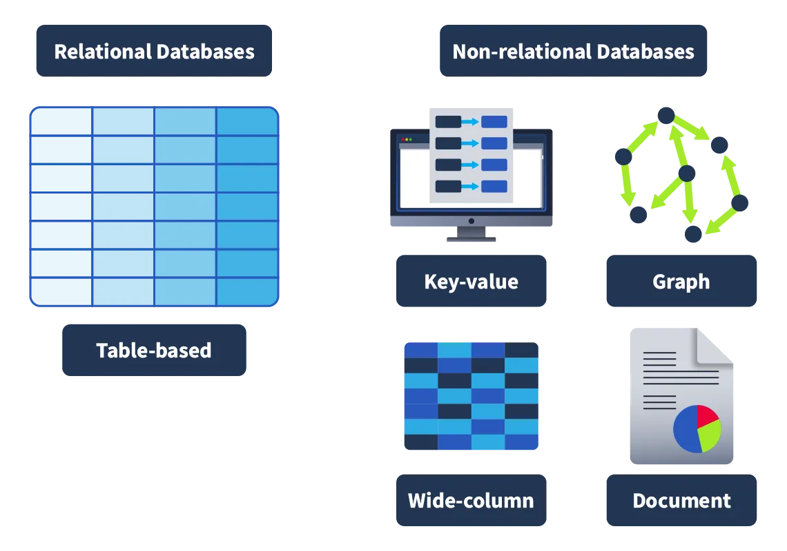
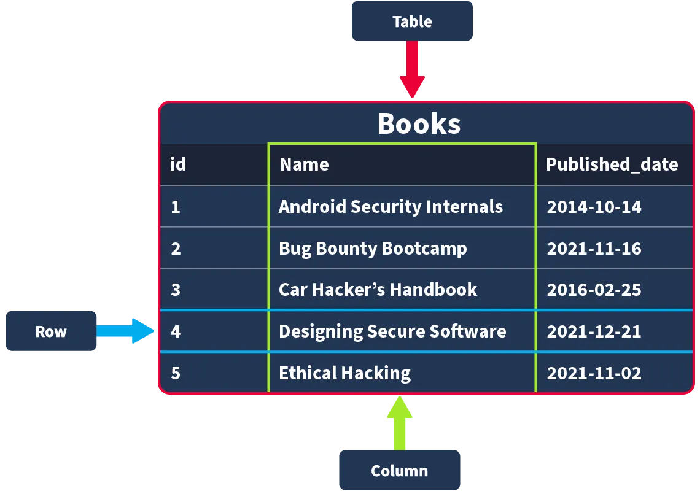
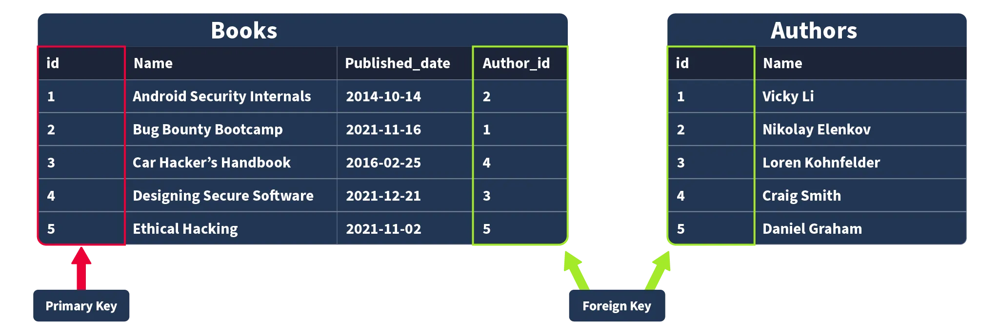

# **Cơ bản về SQL**

#### **I, Giới thiệu về cơ sở dữ liệu(Introducing Databases)**

Cơ sở dữ liệu là một tập hợp thông tin hoặc dữ liệu có cấu trúc được tổ chức, dễ dàng truy cập và có thể được thao tác hoặc phân tích. Dữ liệu đó có thể tồn tại dưới nhiều hình thức, chẳng hạn như dữ liệu xác thực người dùng (như tên người dùng và mật khẩu), được lưu trữ và kiểm tra khi xác thực vào một ứng dụng hoặc trang web (ví dụ như TryHackMe), dữ liệu do người dùng tạo trên mạng xã hội (như Instagram và Facebook) nơi dữ liệu như bài đăng, bình luận, lượt thích của người dùng, v.v. được thu thập và lưu trữ, cũng như thông tin như lịch sử xem được lưu trữ bởi các dịch vụ phát trực tuyến như Netflix và được sử dụng để tạo đề xuất.

Cơ sở dữ liệu được sử dụng rộng rãi và có thể chứa nhiều nội dung khác nhau. Không chỉ các doanh nghiệp quy mô lớn mới sử dụng cơ sở dữ liệu. Các doanh nghiệp quy mô nhỏ hơn, khi thành lập, gần như chắc chắn sẽ phải cấu hình cơ sở dữ liệu để lưu trữ dữ liệu. Nói về các loại cơ sở dữ liệu, hãy cùng xem xét chúng là gì.

#### **II, Các loại cơ sở dữ liệu khác nhau(Different Types of Databases)**

Giờ thì việc một thứ được rất nhiều người sử dụng và sử dụng trong thời gian (tương đối) dài đến mức cần có nhiều loại triển khai khác nhau là điều dễ hiểu. Có khá nhiều loại cơ sở dữ liệu khác nhau có thể được xây dựng, nhưng trong phần giới thiệu này, chúng ta sẽ tập trung vào hai loại chính: cơ sở dữ liệu quan hệ (còn gọi là SQL ) và cơ sở dữ liệu phi quan hệ (còn gọi là NoSQL).

* **Cơ sở dữ liệu quan hệ(Relational databases)**:  Lưu trữ dữ liệu có cấu trúc, nghĩa là dữ liệu được chèn vào cơ sở dữ liệu này tuân theo một cấu trúc nhất định. Ví dụ: dữ liệu được thu thập về người dùng bao gồm first\_name, last\_name, email\_address, username và password. Khi một người dùng mới tham gia, một mục nhập sẽ được tạo trong cơ sở dữ liệu theo cấu trúc này. Dữ liệu có cấu trúc này được lưu trữ theo hàng và cột trong một bảng (tất cả sẽ được đề cập sau); sau đó, có thể thiết lập mối quan hệ giữa hai hoặc nhiều bảng (ví dụ: user và order\_history), do đó có thuật ngữ cơ sở dữ liệu quan hệ.

* **Cơ sở dữ liệu phi quan hệ(Non-relational databases)**: Thay vì lưu trữ dữ liệu theo cách trên, hãy lưu trữ dữ liệu ở định dạng phi bảng. Ví dụ: nếu tài liệu đang được quét, có thể chứa nhiều loại và số lượng dữ liệu khác nhau, và được lưu trữ trong cơ sở dữ liệu yêu cầu định dạng phi bảng.

Về việc lựa chọn cơ sở dữ liệu nào, điều quan trọng luôn phụ thuộc vào bối cảnh sử dụng cơ sở dữ liệu đó. Cơ sở dữ liệu quan hệ thường được sử dụng khi dữ liệu được lưu trữ chắc chắn sẽ được nhận ở một định dạng nhất quán, trong đó độ chính xác là yếu tố quan trọng, chẳng hạn như khi xử lý các giao dịch thương mại điện tử.  Mặt khác, cơ sở dữ liệu phi quan hệ được sử dụng tốt hơn khi dữ liệu nhận được có thể rất khác nhau về định dạng nhưng cần được thu thập và sắp xếp tại cùng một nơi, chẳng hạn như các nền tảng mạng xã hội thu thập nội dung do người dùng tạo ra.

#### **Bảng, Hàng và Cột(Tables, Rows and Columns)**

Bây giờ chúng ta đã định nghĩa hai loại cơ sở dữ liệu chính, chúng ta sẽ tập trung vào cơ sở dữ liệu quan hệ. Chúng ta sẽ bắt đầu bằng cách giải thích về bảng , hàng và cột . Tất cả dữ liệu được lưu trữ trong cơ sở dữ liệu quan hệ sẽ được lưu trữ trong một bảng ; ví dụ, một bộ sưu tập sách đang có trong kho tại một hiệu sách có thể được lưu trữ trong một bảng có tên là "Sách".

Khi tạo bảng này, bạn cần xác định những thông tin cần thiết để định nghĩa một bản ghi sách, ví dụ: "ID", "Name" và "Published\_date". Sau đó, đây sẽ là các cột của bạn ; khi xác định các cột này, bạn cũng sẽ xác định kiểu dữ liệu mà cột này nên chứa; nếu có nỗ lực chèn một bản ghi vào cơ sở dữ liệu mà kiểu dữ liệu không khớp, nó sẽ bị từ chối. Các kiểu dữ liệu có thể được xác định có thể khác nhau tùy thuộc vào cơ sở dữ liệu bạn đang sử dụng, nhưng các kiểu dữ liệu cốt lõi được sử dụng bao gồm Chuỗi (một tập hợp các từ và ký tự), Số nguyên (số), Số thực/Số thập phân (số có dấu thập phân) và Thời gian/Ngày tháng.

Sau khi tạo bảng với các cột đã xác định, bản ghi đầu tiên sẽ được chèn vào cơ sở dữ liệu, ví dụ: một cuốn sách có tên "Android Security Internals" với id là "1" và ngày xuất bản là "2014-10-14". Sau khi được chèn, bản ghi này sẽ được biểu diễn dưới dạng một hàng .

#### **Khóa chính và khóa ngoại(Primary and Foreign Keys)**

Sau khi một bảng đã được định nghĩa và điền đầy đủ dữ liệu, có thể cần lưu trữ thêm dữ liệu. Ví dụ, chúng ta muốn tạo một bảng có tên "Tác giả" để lưu trữ danh sách tác giả của những cuốn sách được bán trong cửa hàng. Dưới đây là một ví dụ rất rõ ràng về mối quan hệ này. Một cuốn sách (được lưu trữ trong bảng Sách) được viết bởi một tác giả (được lưu trữ trong bảng Tác giả). Nếu chúng ta muốn truy vấn một cuốn sách trong câu chuyện của mình nhưng cũng muốn tác giả của cuốn sách đó được trả về, dữ liệu của chúng ta cần phải được liên kết bằng cách nào đó; chúng ta thực hiện việc này bằng các khóa. Có hai loại khóa :

**Khóa chính(Primary Keys)** : Khóa chính được sử dụng để đảm bảo dữ liệu được thu thập trong một cột nhất định là duy nhất. Nghĩa là, cần phải có một cách để xác định mỗi bản ghi được lưu trữ trong một bảng, một giá trị duy nhất cho bản ghi đó và không bị lặp lại bởi bất kỳ bản ghi nào khác trong bảng đó. Hãy nghĩ về số hiệu nhập học trong một trường đại học; đây là những số được gán cho một sinh viên để họ có thể được xác định duy nhất trong các bản ghi (vì đôi khi sinh viên có thể có cùng tên). Một cột phải được chọn trong mỗi bảng làm khóa chính; trong ví dụ của chúng tôi, "id" sẽ hợp lý nhất vì một id đã được tạo duy nhất cho mỗi cuốn sách, trong đó, các cuốn sách có thể có cùng ngày xuất bản hoặc (trong trường hợp hiếm hơn) tên sách. Lưu ý rằng chỉ có thể có một cột khóa chính trong một bảng.

**Khóa Ngoại(Foreign Keys)** : Khóa ngoại là một cột (hoặc nhiều cột) trong một bảng, đồng thời cũng tồn tại trong một bảng khác trong cơ sở dữ liệu, do đó tạo ra một liên kết giữa hai bảng. Trong ví dụ này, hãy tưởng tượng việc thêm trường "author\_id" vào bảng "Books"; trường này sẽ hoạt động như một khóa ngoại vì author\_id trong bảng "Books" tương ứng với cột "id" trong bảng "author". Khóa ngoại cho phép thiết lập mối quan hệ giữa các bảng khác nhau trong cơ sở dữ liệu quan hệ. Lưu ý rằng có thể có nhiều hơn một cột khóa ngoại trong một bảng.

# **III, SQL**

#### **SQL là gì ?**

Về mặt lý thuyết, tất cả những điều này nghe có vẻ tuyệt vời, nhưng trên thực tế, cơ sở dữ liệu hoạt động như thế nào? Bạn sẽ tạo bảng đầu tiên và điền dữ liệu vào đó như thế nào? Bạn sẽ sử dụng cái gì? Cơ sở dữ liệu thường được điều khiển bằng Hệ thống Quản lý Cơ sở dữ liệu (DBMS). Đóng vai trò là giao diện giữa người dùng cuối và cơ sở dữ liệu, DBMS là một chương trình phần mềm cho phép người dùng truy xuất, cập nhật và quản lý dữ liệu đang được lưu trữ. Một số ví dụ về DBMS bao gồm MySQL, MongoDB, Oracle Database và Maria DB.

Tương tác giữa người dùng cuối và cơ sở dữ liệu có thể được thực hiện bằng SQL (Ngôn ngữ truy vấn có cấu trúc). SQL là ngôn ngữ lập trình có thể được sử dụng để truy vấn, định nghĩa và thao tác dữ liệu được lưu trữ trong cơ sở dữ liệu quan hệ.

#### **Lợi ích của SQL và cơ sở dữ liệu quan hệ**

SQL gần như phổ biến như chính cơ sở dữ liệu, và điều này hoàn toàn có lý do. Dưới đây là một số lợi ích khi học và sử dụng SQL :

* **Nhanh** :  Cơ sở dữ liệu quan hệ (hay còn gọi là cơ sở dữ liệu sử dụng SQL ) có thể trả về khối lượng dữ liệu khổng lồ gần như ngay lập tức do sử dụng rất ít không gian lưu trữ và tốc độ xử lý cao.

* **Dễ học**:  Không giống như nhiều ngôn ngữ lập trình khác, SQL được viết bằng tiếng Anh đơn giản, giúp việc học dễ dàng hơn nhiều. Tính dễ đọc của ngôn ngữ này giúp người dùng có thể tập trung vào việc học các hàm và cú pháp.

* **Đáng tin cậy**:  Như đã đề cập trước đó, cơ sở dữ liệu quan hệ có thể đảm bảo mức độ chính xác khi xử lý dữ liệu bằng cách xác định cấu trúc nghiêm ngặt mà các tập dữ liệu phải nằm trong đó để có thể chèn vào.

* **Linh hoạt**:  SQL cung cấp mọi khả năng khi truy vấn cơ sở dữ liệu; điều này cho phép người dùng thực hiện các tác vụ phân tích dữ liệu lớn một cách rất hiệu quả.

#### **Câu lệnh cơ sở dữ liệu và bảng**

* **TẠO CƠ SỞ DỮ LIỆU**

Nếu cần một cơ sở dữ liệu mới, bước đầu tiên bạn cần thực hiện là tạo cơ sở dữ liệu đó. Việc này có thể được thực hiện trong SQL bằng câu lệnh sau : **CREATE DATABASE** 
<pre> mysql> CREATE DATABASE thm_bookmarket_db; </pre>

* **HIỂN THỊ CƠ SỞ DỮ LIỆU**

Bây giờ chúng ta đã tạo xong cơ sở dữ liệu, chúng ta có thể xem nó bằng câu lệnh **SHOW DATABASES**. Câu lệnh **SHOW DATABASES** sẽ trả về danh sách các cơ sở dữ liệu hiện có. Chạy câu lệnh như sau:

<pre>mysql> SHOW DATABASES;</pre>

Trong danh sách trả về, bạn sẽ thấy cơ sở dữ liệu vừa tạo và một số cơ sở dữ liệu được bao gồm theo mặc định (mysql, information\_scheme, performance\_scheme và sys), được sử dụng cho nhiều mục đích khác nhau để mysql hoạt động.

* **SỬ DỤNG CƠ SỞ DỮ LIỆU**

Sau khi tạo cơ sở dữ liệu, bạn có thể muốn tương tác với nó. Trước khi có thể tương tác, chúng ta cần cho mysql biết chúng ta muốn tương tác với cơ sở dữ liệu nào (để mysql biết cần chạy các truy vấn tiếp theo với cơ sở dữ liệu nào). Để thiết lập cơ sở dữ liệu vừa tạo làm cơ sở dữ liệu đang hoạt động, chúng ta sẽ chạy **USE** câu lệnh như sau (hãy đảm bảo chạy câu lệnh này trên máy của bạn):

<pre>mysql> USE DATABASES;</pre>

* **XÓA CƠ SỞ DỮ LIỆU**

Khi một cơ sở dữ liệu không còn cần thiết nữa (có thể nó được tạo ra cho mục đích thử nghiệm, hoặc không còn cần thiết nữa), bạn có thể xóa nó bằng **DROP** câu lệnh. Để xóa cơ sở dữ liệu, chúng ta sẽ sử dụng cú pháp câu lệnh sau (mặc dù trong trường hợp này, chúng ta muốn giữ lại cơ sở dữ liệu, vì vậy không cần phải tự chạy câu lệnh này!):

<pre>mysql> DROP database database_name;</pre>

* **CÂU LỆNH BẢNG**

**Tạo bảng :**

Theo logic của các câu lệnh cơ sở dữ liệu, việc tạo bảng cũng sử dụng một câu lệnh **CREATE**. Khi cơ sở dữ liệu đã hoạt động (bạn đã chạy USE câu lệnh trên đó), một bảng có thể được tạo bên trong cơ sở dữ liệu đó bằng cú pháp câu lệnh sau:

<pre>mysql> CREATE TABLE table_name (
    column1 datatype [constraint],
    column2 datatype [constraint],
    column3 datatype [constraint],
);</pre>

**Bảng hiển thị :**

Cũng như chúng ta có thể liệt kê các cơ sở dữ liệu bằng câu lệnh **SHOW**, chúng ta cũng có thể liệt kê các bảng trong cơ sở dữ liệu hiện đang hoạt động (cơ sở dữ liệu mà chúng ta đã sử dụng câu lệnh **USE** lần cuối). Chạy lệnh sau, bạn sẽ thấy bảng vừa tạo:

<pre>mysql> SHOW TABLES;</pre>

* **MÔ TẢ**

Nếu chúng ta muốn biết những cột nào có trong một bảng (và kiểu dữ liệu của chúng), chúng ta có thể mô tả chúng bằng lệnh **DESCRIBE** (cũng có thể viết tắt là DESC). Hãy mô tả bảng bạn vừa tạo bằng lệnh sau:

<pre>mysql> DESCRIBE TABLE;</pre>

* **THAY ĐỔI**

Sau khi tạo bảng, có thể sẽ đến lúc nhu cầu về tập dữ liệu của bạn thay đổi và bạn cần chỉnh sửa bảng. Việc này có thể được thực hiện bằng cách sử dụng **ALTER** câu lệnh. Bây giờ, hãy tưởng tượng rằng chúng ta thực sự muốn có một cột trong kho sách chứa số trang của mỗi cuốn sách. Thêm cột này vào bảng bằng câu lệnh sau:

<pre>mysql> ALTER TABLE table_name
    ADD page_count INT;</pre>

Câu lệnh này **ALTER** có thể được sử dụng để thực hiện các thay đổi trong bảng, chẳng hạn như đổi tên cột, thay đổi kiểu dữ liệu trong cột hoặc xóa cột.

* **LÀM RƠI**

Tương tự như xóa cơ sở dữ liệu, bạn cũng có thể xóa bảng bằng câu lệnh **DROP**. Chúng ta không cần phải làm điều này, nhưng cú pháp bạn có thể sử dụng là:

<pre>mysql> DROP TABLE table_name;</pre>

#### **Hoạt động CRUD**

* **CRUD**

**CRUD** là viết tắt của Tạo , Đọc , Cập nhật và Xóa , được coi là các thao tác cơ bản trong bất kỳ hệ thống quản lý dữ liệu nào.

Hãy cùng khám phá tất cả các thao tác khác nhau này khi làm việc với **MySQL** .

* **Tạo hoạt động (INSERT)**

Thao tác Create sẽ tạo các bản ghi mới trong một bảng. Trong MySQL, thao tác này có thể được thực hiện bằng cách sử dụng câu lệnh **INSERT INTO**, như minh họa bên dưới.

<pre>mysql> INSERT INTO table_name (id, name, published_date, description)</pre>

Như chúng ta có thể thấy, INSERT INTO câu lệnh này chỉ định một bảng, nơi bạn có thể thêm một bản ghi mới; các cột id , name , published_date và description là các bản ghi trong bảng.

* **Đọc hoạt động (SELECT)**

Thao tác Đọc , đúng như tên gọi, được sử dụng để đọc hoặc lấy thông tin từ một bảng. Chúng ta có thể lấy một cột hoặc tất cả các cột từ một bảng bằng câu lệnh **SELECT**

<pre>mysql> SELECT * FROM table_name;</pre>

Câu lệnh đầu ra ở trên **SELECT** được theo sau bởi một **\*** ký hiệu cho biết tất cả các cột sẽ được truy xuất, theo sau là **FROM** mệnh đề và tên bảng.

Nếu chúng ta muốn chọn một cột cụ thể như tên và mô tả , chúng ta nên chỉ định chúng thay vì * ký hiệu, như được hiển thị bên dưới.

<pre>mysql> SELECT name, description FROM tables_name;</pre>

* **Hoạt động cập nhật (UPDATE)**

Hoạt động Cập nhật **UPDATE** sẽ sửa đổi một bản ghi hiện có trong một bảng và có thể sử dụng cùng một câu lệnh , cho mục đích này.

<pre>mysql> UPDATE tables_name;</pre>

Câu **UPDATE** lệnh chỉ định bảng, sau đó chúng ta có thể sử dụng **SET** theo sau là tên cột mà chúng ta sẽ cập nhật. **WHERE** Mệnh đề chỉ định hàng nào sẽ cập nhật khi mệnh đề được đáp ứng.

* **Xóa thao tác (DELETE)**

Thao tác xóa sẽ xóa các bản ghi khỏi bảng. Chúng ta có thể thực hiện thao tác này bằng câu lệnh **DELETE**.

<pre>mysql> DELETE FROM tables_name WHERE id = 1;</pre>

Ở trên, chúng ta có thể quan sát **DELETE** câu lệnh theo sau là **FROM** mệnh đề cho phép chúng ta chỉ định bảng mà bản ghi sẽ bị xóa, theo sau là **WHERE** mệnh đề cho biết rằng đó phải là bảng có id là 1 .

#### **Các điều khoản(Clauses)**

* **Mệnh đề DISTINCT**

Mệnh đề này **DISTINCT** được sử dụng để tránh các bản ghi trùng lặp khi thực hiện truy vấn, chỉ trả về các giá trị duy nhất.

<pre>mysql> SELECT DISTINCT name FROM tables_name;</pre>

* **Mệnh đề GROUP BY**

Mệnh đề này **GROUP BY** tổng hợp dữ liệu từ nhiều bản ghi và nhóm kết quả truy vấn thành các cột. Điều này có thể hữu ích cho việc tổng hợp các hàm.

<pre>mysql> SELECT cot_1, cot_2, [hàm_tổng_hợp(cot_3)]
FROM ten_bang
WHERE dieu_kien
GROUP BY cot_1, cot_2
[HAVING dieu_kien_nhom]
[ORDER BY cot_1];</pre>

VD : Nhóm các sinh viên theo Lop, sau đó đếm số lượng sinh viên trong mỗi lớp.
<pre>mysql> SELECT Lop, COUNT(MaSV) AS SoLuongSV
FROM SinhVien
GROUP BY Lop;</pre>

* **Mệnh đề ORDER BY**

Mệnh đề này **ORDER BY** có thể được sử dụng để sắp xếp các bản ghi được trả về bởi một truy vấn theo thứ tự tăng dần hoặc giảm dần. Việc sử dụng các hàm như **ASC** và **DESC** có thể giúp chúng ta thực hiện điều đó.

<pre>mysql> SELECT cot_1, cot_2, ...
FROM ten_bang
[WHERE dieu_kien]
[GROUP BY cot_nhom]
ORDER BY cot_sap_xep [ASC | DESC];</pre>

Chúng ta có thể quan sát sự khác biệt khi sắp xếp theo thứ tự tăng dần bằng cách sử dụng **ASC** và theo thứ tự giảm dần bằng cách sử dụng **DESC**.

* **Mệnh đề HAVING**

Mệnh đề này **HAVING** được sử dụng cùng với các mệnh đề khác để lọc nhóm hoặc kết quả của các bản ghi dựa trên một điều kiện. Trong trường hợp **GROUP BY**, nó đánh giá điều kiện thành **TRUE** hoặc **FALSE**, không giống như **WHERE** mệnh đề **HAVING** lọc kết quả sau khi quá trình tổng hợp được thực hiện.

<pre>mysql> SELECT cot_1, ham_tong_hop(cot_2)
FROM ten_bang
WHERE dieu_kien_hang
GROUP BY cot_1
HAVING dieu_kien_nhom
ORDER BY cot_1;</pre>

VD : Tính điểm trung bình của từng lớp,rồi chỉ hiển thị các lớp có điểm trung bình ≥ 7.
<pre>mysql> SELECT Lop, AVG(DiemTB) AS DiemTrungBinh
FROM SinhVien
GROUP BY Lop
HAVING AVG(DiemTB) >= 7;</pre>

#### **Operaters**

* **Toán tử logic**

Các toán tử này kiểm tra tính đúng đắn của một điều kiện và trả về giá trị boolean là TRUE hoặc FALSE. Tiếp theo, chúng ta hãy cùng khám phá một số toán tử này.

* **Toán tử LIKE**

Toán tử này **LIKE** thường được sử dụng kết hợp với các mệnh đề như " WHERE to filter" để lọc các mẫu cụ thể trong một cột. Hãy tiếp tục sử dụng **DataBase** của chúng ta để truy vấn một ví dụ về cách sử dụng của nó.

<pre>mysql> SELECT cot_1, cot_2, ...
FROM ten_bang
WHERE cot LIKE 'mẫu_tìm_kiếm';</pre>

VD : Tìm tất cả sinh viên có họ bắt đầu bằng “Nguyen”
<pre>mysql> SELECT * FROM SinhVien
WHERE HoTen LIKE 'Nguyen%';</pre>

#### **Functions**

* **Hàm CONCAT()**

Hàm này được sử dụng để cộng hai hoặc nhiều chuỗi lại với nhau. Hàm này hữu ích để kết hợp văn bản từ các cột khác nhau.

<pre>mysql> SELECT CONCAT(chuoi1, chuoi2, ...); </pre>

* **Hàm GROUP_CONCAT()**

Hàm này có thể giúp chúng ta nối dữ liệu từ nhiều hàng vào một trường. Hãy cùng khám phá một ví dụ về cách sử dụng hàm này.

<pre>mysql> SELECT GROUP_CONCAT(col SEPARATOR 'ngăn_cách')
FROM ten_bang
GROUP BY cot_nhom;</pre>

* **Hàm SUBSTRING()**

Hàm này sẽ lấy một chuỗi con từ một chuỗi trong truy vấn, bắt đầu từ một vị trí xác định. Độ dài của chuỗi con này cũng có thể được chỉ định.

<pre>mysql> SELECT SUBSTRING(chuoi, vi_tri_bat_dau, do_dai);</pre>

* **Hàm LENGTH()**

Hàm này trả về số ký tự trong một chuỗi. Số ký tự này bao gồm cả khoảng trắng và dấu câu. Chúng ta có thể xem ví dụ bên dưới.

<pre>mysql> SELECT LENGTH(chuoi);</pre>

* **Hàm COUNT()**

Hàm này trả về số lượng bản ghi trong một biểu thức.

<pre>mysql> SELECT COUNT(cot)
FROM ten_bang
[WHERE dieu_kien];</pre>

* **Hàm SUM()**

Hàm này tính tổng tất cả các giá trị (không phải NULL) của một cột xác định.

<pre>mysql> SELECT SUM(cot)
FROM ten_bang;</pre>

* **Hàm MAX()**

Hàm này tính giá trị lớn nhất trong một cột được cung cấp trong một biểu thức.

<pre>mysql> SELECT MAX(cot)
FROM ten_bang;</pre>

* **Hàm MIN()**

Hàm này tính giá trị nhỏ nhất trong một cột được cung cấp trong một biểu thức.

<pre>mysql> SELECT MIN(tên_cột)
FROM tên_bảng;</pre>